# SubEquipe_01

## Focos do Relatório

### FOCO_01: Modelagem Estática

### Participantes no Foco_01

| Participantes                     |
| --------------------------------- |
| GIOVANNA AGUIAR DE BRITO          |
| JOAO PEDRO LOPES DA CRUZ          |
| JÚLIA GABRIELLA FERREIRA SIQUEIRA |
| PEDRO HENRIQUE FERREIRA XAVIER    |

### Metodologia do Foco_01

A modelagem estática do subgrupo concentrou-se na elaboração de diagramas de pacotes para representar a organização do portal de notícias e as dependências entre suas partes. Os materiais da disciplina e as referências de UML registradas nos artefatos individuais serviram de apoio à compreensão da notação e à discussão das alternativas de organização do sistema.

O trabalho reuniu propostas individuais e uma discussão em equipe para compor a visão consolidada. As diferentes propostas permitiram comparar a separação por camadas, a distribuição das funcionalidades e a distinção entre serviços disponíveis a usuários anônimos e autenticados. A versão do grupo apresenta os pacotes de Apresentação, Aplicação, Serviços Anônimos, Serviços de Usuários e Infraestrutura, com suas relações de uso. As versões individuais foram mantidas no relatório para registrar as contribuições e permitir a comparação com a proposta conjunta.

O uso de IA como apoio à elaboração é descrito nos relatos individuais, acompanhado das referências e evidências disponíveis. Esses registros permitem distinguir as sugestões recebidas das decisões representadas nos diagramas.

### Diagrama de pacotes

Diagrama de pacotes com a visão consolidada do subgrupo sobre o domínio estudado.

<figure style="text-align: center;">
    <a href="../../../assets/subGrupo1/pacotesgrupo.html" target="_blank" rel="noopener noreferrer" title="Abrir diagrama ampliado e centralizado">
        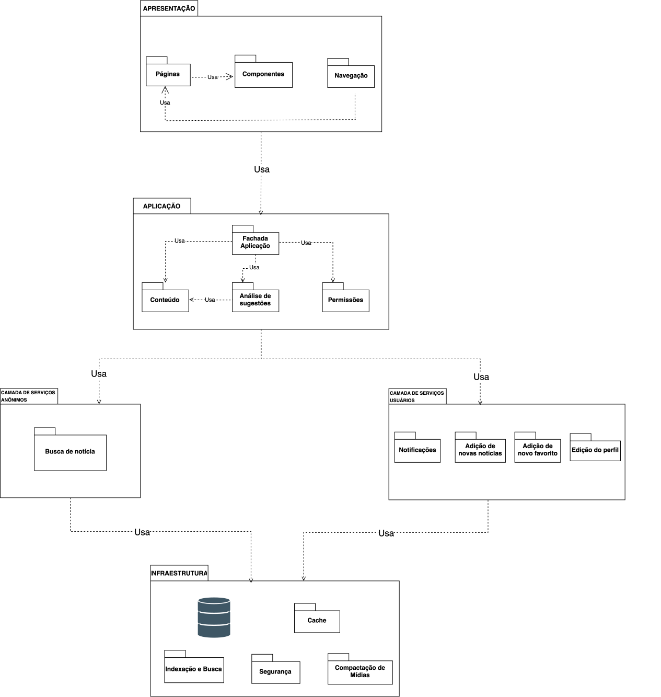
    </a>
    <figcaption>
        <p style="text-align: center; font-size: 10pt;">
            Figura: Diagrama de pacotes do Grupo (Fonte: SubEquipe 01, 2026)<br>
            Clique na imagem para abrir o diagrama ampliado.
        </p>
    </figcaption>
</figure>

??? note "Diagrama de pacotes: João Pedro"

    <figure style="text-align: center;">
        
        <figcaption>
            <p style="text-align: center; font-size: 10pt;">
                Figura: Diagrama de pacotes Individual (Fonte: <a href="https://github.com/ojplc">João Pedro</a>, 2026)
            </p>
        </figcaption>
        <p style="text-align: left;">
        Referências: [Dependências em UML](https://www.uml-diagrams.org/dependency.html), [Overview em diagramas de pacotes](https://www.uml-diagrams.org/package-diagrams-overview.html)<br><br>
        FOCO_03:<br>
        Usei a IA para ela me auxiliar a definir um padrão arquitetural adequado, eu tinha em mente que o MVC dos exemplos não seria suficiente para atender o site, tendo em vista que a ação de leitura seria muito maior que a da escrita e apenas o MVC não lidaria bem com a escalabilidade e muitos acessos simultâneos.
        IA sugeriu uma estrutura de múltiplos serviços (microsserviços) e foi nessa linha que eu decidi seguir, como a camada de dados será a mais utilizada ela poderá ser mais robusta, tolerando mais acessos, enquanto a camada de serviços pode ser um pouco menor
        Pedi para a IA gerar um diagrama de pacotes e passei as principais funcionalidades, ela me devolveu um código mermaid para visualização do diagrama. Contudo, a ferramenta não separou corretamente os microsserviços no desenho dela, colocando tudo em um bolo só, além disso não foram seguidas as regras de representação do diagrama (como os termos usa e importa da dependência, uso incorreto das setas e desenho de banco de dados).
        </p>

    ```mermaid
    flowchart TD
        %% Camada de Apresentação
        subgraph Clients ["1. Camada de Clientes"]
            Web[Web Browser]
            App[App Mobile]
        end

        %% Porta de Entrada
        subgraph Gateway ["2. API Gateway / BFF"]
            Router["Roteamento & Autenticação<br>(valida token JWT)"]
        end

        %% Domínios de Negócio (Microsserviços)
        subgraph Services ["3. Microsserviços de Domínio"]
            News["Pacote: News Service<br>(Leitura, Publicação e Categorização)"]
            User["Pacote: User Service<br>(Perfil, Auth, Favoritos, Tópicos)"]
            Notif["Pacote: Notification Service<br>(Push, Email, WebSocket)"]
            Reco["Pacote: Recommendation Service<br>(Sugestão de Notícias)"]
            Search["Pacote: Search Service<br>(Busca e Filtro por Categoria)"]
        end

        %% Infraestrutura de Eventos
        subgraph EventBus ["4. Message Broker (Event-Driven)"]
            Kafka[("Kafka / RabbitMQ")]
        end

        %% Bancos de Dados e Caches
        subgraph Databases ["5. Bancos de Dados e Caches"]
            DB_News[("DB Notícias - ex: MongoDB")]
            DB_User[("DB Usuários - ex: PostgreSQL")]
            DB_Notif[("DB Notificações<br>(preferências e histórico de envio)")]
            DB_Reco[("DB Recomendações<br>(perfil de interesse)")]
            Cache[("Cache - Redis<br>(notícias populares/lidas)")]
            Index[("Índice - Elasticsearch<br>(busca por categoria/tags)")]
        end

        %% Relacionamentos e Fluxos
        Clients -->|HTTPS / WebSocket| Gateway
        Gateway -->|REST/gRPC| News
        Gateway -->|REST/gRPC| User
        Gateway -->|REST/gRPC| Reco
        Gateway -->|REST/gRPC| Search

        News --- DB_News
        News --- Cache
        User --- DB_User
        Notif --- DB_Notif
        Reco --- DB_Reco
        Search --- Index

        %% Fluxo de Eventos - Publicação
        News -.->|Publica: NotíciaCriada| Kafka
        News -.->|Publica: NotíciaCategorizada| Kafka
        User -.->|Publica: TópicoSeguido| Kafka
        User -.->|Publica: NotíciaFavoritada| Kafka
        User -.->|Publica: NotíciaLida| Kafka

        %% Fluxo de Eventos - Consumo
        Kafka -.->|Consome: NotíciaCriada| Notif
        Kafka -.->|Consome: NotíciaCriada| Search
        Kafka -.->|Consome: NotíciaCategorizada| Search
        Kafka -.->|Consome: TópicoSeguido| Reco
        Kafka -.->|Consome: NotíciaFavoritada| Reco
        Kafka -.->|Consome: NotíciaLida| Reco
        Kafka -.->|Consome: NotíciaCriada| Reco
    ```


    <figcaption>
        <p style="text-align: center; font-size: 10pt;">
            Figura: Diagrama de pacotes gerado pela IA (Fonte: Google gemini, [Link da conversa com a IA](https://share.gemini.google/pmeFCPVOAy86)</a>, 2026)
        </p>
        <p style="text-align: center; font-size: 10pt;">
            <a href="../SubEquipe_01_pacotes_IA/pacotesIA/" target="_blank" rel="noopener noreferrer">Ver em tela cheia</a>
        </p>
    </figcaption>

    <p style="text-align: left;">
    Ao fazer o meu próprio diagrama separei em camada de segurança, sendo ela a porta de entrada da aplicação, e as camadas de serviços anônimos e serviços do usuário logado, a ideia é que cada camada atue como um serviço próprio independente e que as camadas possam comunicar entre si.
    </p>
    </figure>

??? note "Diagrama de pacotes: Giovanna Aguiar"

    <figure style="text-align: center;">
        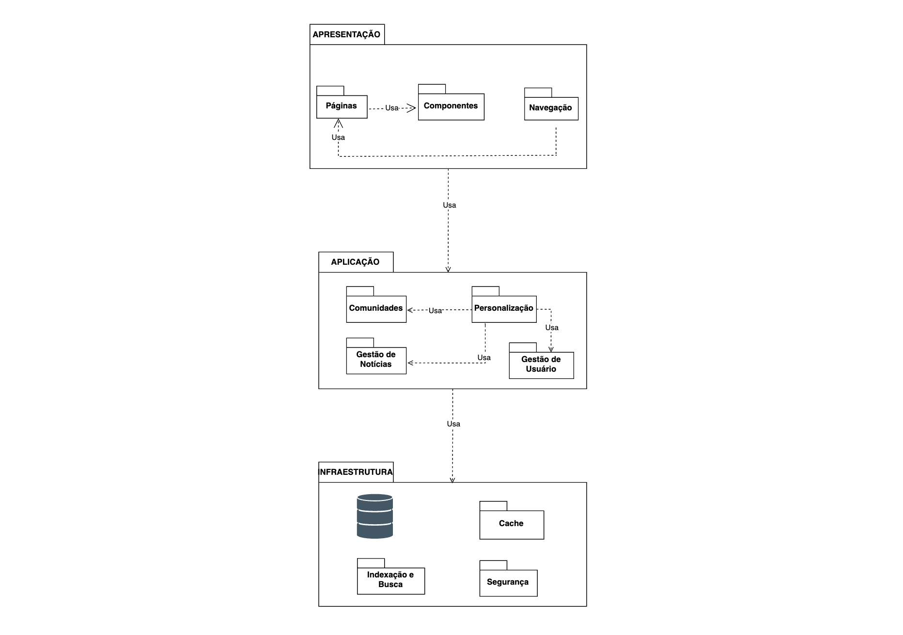
        <figcaption>
            <p style="text-align: center; font-size: 10pt;">
                Figura: Diagrama de pacotes Individual (Fonte: <a href="https://github.com/giovannabrito19">Giovanna Aguiar</a>, 2026)
            </p>
        </figcaption>
    </figure>

    Referências: [UML Package Diagrams Overview](https://www.uml-diagrams.org/package-diagrams-overview.html)

    **FOCO_03:**

    Utilizei os materiais da disciplina, o site UML Diagrams e o ChatGPT durante a elaboração do diagrama de pacotes. Na conversa com a IA, apresentei o contexto do portal de notícias, suas funcionalidades, os slides da professora e exemplos acompanhados de feedbacks de trabalhos anteriores. Com isso, pedi orientações para organizar os pacotes e construir o diagrama no draw.io considerando as características do nosso projeto.

    O ChatGPT me auxiliou passo a passo, sugerindo uma estrutura inicial de camadas e subpacotes e possíveis relações de dependência entre eles. Ao longo da construção, enviei versões do meu diagrama e pedi análises sobre a organização, os elementos que poderiam ser retirados ou acrescentados e o significado das ligações. Também apresentei o SIG/NFR da equipe para discutir os elementos da infraestrutura em relação às necessidades do sistema.

    Durante esse processo, busquei entender melhor os termos e as responsabilidades dos pacotes sugeridos, incluindo serviços de domínio, indexação e busca e segurança. Questionei sugestões que ainda não conseguia justificar no contexto do portal, como a presença de serviços de domínio, e fiz alterações ao longo da conversa. Isso mostrou a importância de compreender o papel de cada pacote e de verificar se uma dependência realmente faz sentido, em vez de acrescentar elementos apenas porque aparecem em uma sugestão da ferramenta.

    Após essa elaboração, revisei a proposta e fiz ajustes a partir da discussão com a equipe. A IA teve uma participação significativa na construção e no esclarecimento de dúvidas, mas suas respostas precisaram ser avaliadas em relação ao material da disciplina e ao escopo do projeto. 

    [Consultar a conversa completa com o ChatGPT](https://chatgpt.com/share/6aac0c3a-d0f8-83e9-92fc-5a274c8f6c80)

    **Evidências do uso de IA**

    Os registros abaixo são trechos selecionados da conversa e mostram sugestões durante a elaboração, não a versão final do diagrama. 

    ??? note "Registro 1: Contexto e pedido de orientação"

        <figure style="text-align: center;">
            <a href="../../../assets/subGrupo1/ia_gi/ia1.png" target="_blank" rel="noopener noreferrer">
                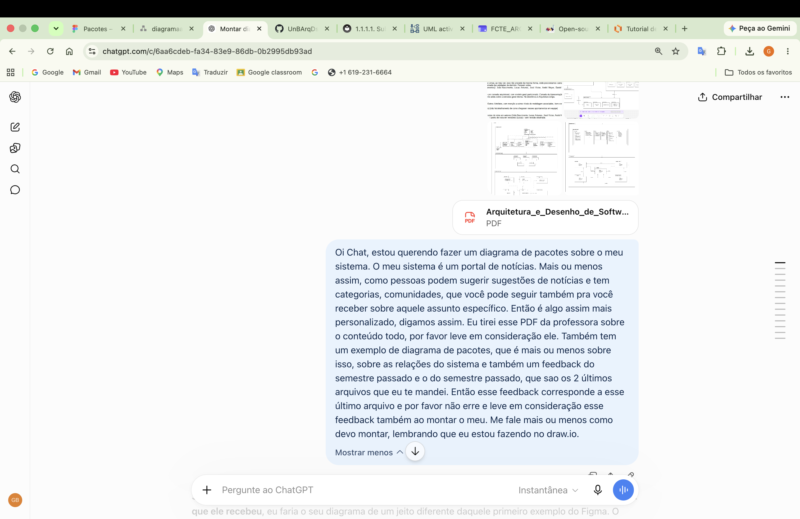
            </a>
            <figcaption>
                <p style="text-align: center; font-size: 10pt;">
                    Figura 1: Contexto do portal, materiais fornecidos e pedido de orientação para construir o diagrama no draw.io. (Fonte: conversa de <a href="https://github.com/giovannabrito19">Giovanna Aguiar</a> com o ChatGPT, 2026)
                </p>
            </figcaption>
        </figure>

    ??? note "Registro 2: Sugestão inicial de camadas"

        <figure style="text-align: center;">
            <a href="../../../assets/subGrupo1/ia_gi/ia2.png" target="_blank" rel="noopener noreferrer">
                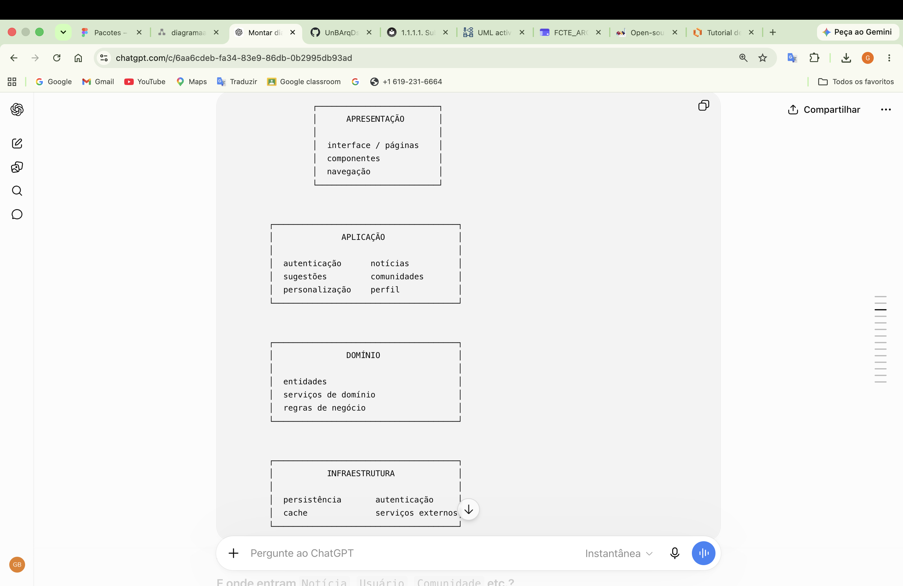
            </a>
            <figcaption>
                <p style="text-align: center; font-size: 10pt;">
                    Figura 2: Sugestão inicial de organização em Apresentação, Aplicação, Domínio e Infraestrutura. (Fonte: conversa de <a href="https://github.com/giovannabrito19">Giovanna Aguiar</a> com o ChatGPT, 2026)
                </p>
            </figcaption>
        </figure>

    ??? note "Registro 3: Proposta inicial de pacotes"

        <figure style="text-align: center;">
            <a href="../../../assets/subGrupo1/ia_gi/ia3.png" target="_blank" rel="noopener noreferrer">
                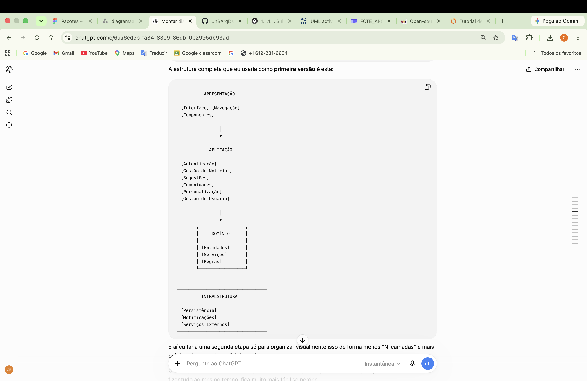
            </a>
            <figcaption>
                <p style="text-align: center; font-size: 10pt;">
                    Figura 3: Proposta inicial de pacotes e organização das camadas apresentada pelo ChatGPT. (Fonte: conversa de <a href="https://github.com/giovannabrito19">Giovanna Aguiar</a> com o ChatGPT, 2026)
                </p>
            </figcaption>
        </figure>

    ??? note "Registro 4: Orientações sobre dependências"

        <figure style="text-align: center;">
            <a href="../../../assets/subGrupo1/ia_gi/ia4.png" target="_blank" rel="noopener noreferrer">
                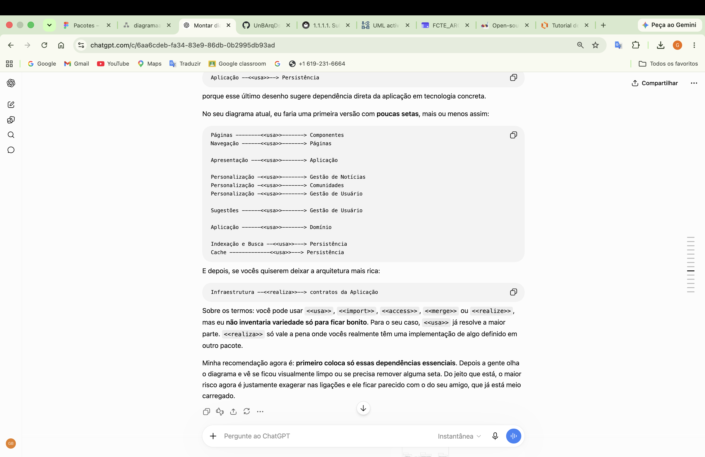
            </a>
            <figcaption>
                <p style="text-align: center; font-size: 10pt;">
                    Figura 4: Orientações do ChatGPT sobre dependências e revisão das ligações entre os pacotes. (Fonte: conversa de <a href="https://github.com/giovannabrito19">Giovanna Aguiar</a> com o ChatGPT, 2026)
                </p>
            </figcaption>
        </figure>

??? note "Diagrama de pacotes: Pedro Henrique"

    <figure style="text-align: center;">
        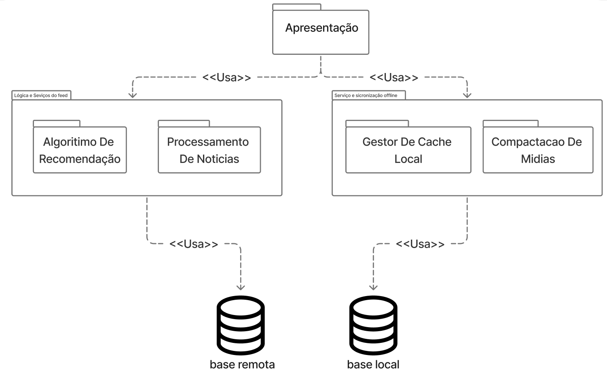
        <figcaption>
            <p style="text-align: center; font-size: 10pt;">
                Figura: Diagrama de pacotes Individual (Fonte: <a href="https://github.com/PedroGTG">Pedro Henrique</a>, 2026)
            </p>
        </figcaption>
    </figure>

    Referências: [tutorial de diagrama de pacotes](https://lucid.co/pt/diagrama/uml/tutorial-de-diagrama-de-pacotes)
    [Visão geral de diagramas de pacotes UML](https://www.youtube.com/watch?v=o4srs54NciI)
    [Diagrama de pacotes UML](https://www.youtube.com/watch?v=CWj2F9dfIaU)

    **FOCO_03:**

    Utilizei a inteligência artificial generativa como ferramenta de apoio para compreender os fundamentos do diagrama de pacotes UML e estruturar a arquitetura do portal de notícias. O processo de interação focou, na aplicação de boas práticas arquiteturais e no alinhamento com os materiais fornecidos na disciplina.

    Inicialmente, busquei esclarecer conceitos essenciais da notação UML, compreendendo o papel dos pacotes como elementos de agrupamento lógico, os níveis de visibilidade de membros e os tipos de relacionamentos de dependência, como `<<use>>`, `<<import>>` e `<<access>>`. Em seguida, explorei as finalidades de alto nível do diagrama, como a redução do acoplamento e o mapeamento direto de namespaces e pastas do projeto, além de avaliar restrições cruciais para a modelagem, incluindo a regra do Grafo Acíclico Dirigido (DAG) para evitar dependências circulares.

    Com o avanço da modelagem, forneci à IA os materiais e slides da aula para garantir que a proposta estivesse alinhada com a visão de "espelho" do código (mapeando camadas de View, Controller, Service/Model e Database). Discutimos detalhadamente a semântica dos estereótipos para definir adequadamente o acesso entre repositórios e entidades, diferenciando a visibilidade pública e transitiva do `<<import>>` em relação ao encapsulamento privado do `<<access>>`. Também comparamos os modelos de arquitetura restrita (*strict layering*) e relaxada (*relaxed layering*).

    O suporte da IA foi fundamental para guiar as decisões notacionais e estruturais, funcionando como um parceiro de estudo. Contudo, cada sugestão fornecida pela ferramenta passou por um filtro crítico previnir erros e manter a consistência na qualidade.

    **Evidências do uso de IA**

    Os registros abaixo apresentam trechos selecionados das interações com a IA generativa, demonstrando o processo de estudo notacional e definição arquitetural durante a elaboração do diagrama.

    ??? note "Registro 1: Conceituação e elementos fundamentais do diagrama de pacotes"

        <figure style="text-align: center;">
            <a href="../../../assets/subGrupo1/ia_pedro/IApacotes2.png" target="_blank" rel="noopener noreferrer">
                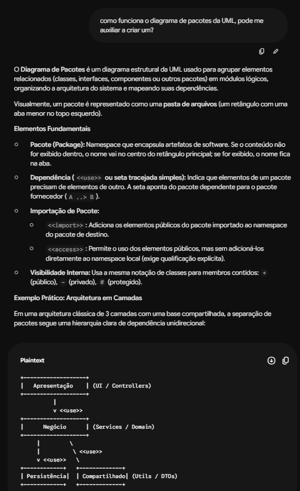
            </a>
            <figcaption>
                <p style="text-align: center; font-size: 10pt;">
                    Figura 1: Conceituação notacional, elementos fundamentais (pacotes, dependências, visibilidade) e exemplo de arquitetura em camadas. (Fonte: conversa de <a href="https://github.com/PedroGTG">Pedro Henrique</a> com a IA, 2026)
                </p>
            </figcaption>
        </figure>

    ??? note "Registro 2: Propósitos arquiteturais e restrições notacionais"

        <figure style="text-align: center;">
            <a href="../../../assets/subGrupo1/ia_pedro/pacotes3.png" target="_blank" rel="noopener noreferrer">
                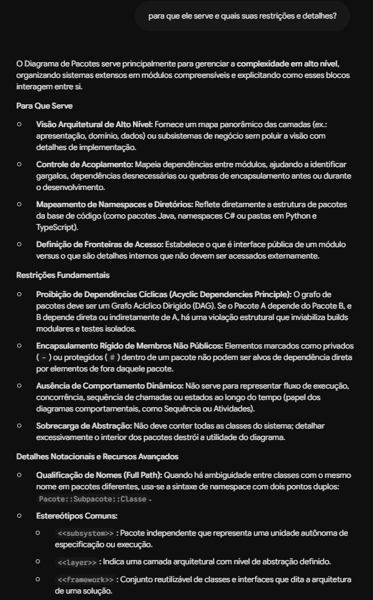
            </a>
            <figcaption>
                <p style="text-align: center; font-size: 10pt;">
                    Figura 2: Esclarecimentos sobre a finalidade do diagrama, controle de acoplamento e restrições estruturais como o Grafo Acíclico Dirigido (DAG). (Fonte: conversa de <a href="https://github.com/PedroGTG">Pedro Henrique</a> com a IA, 2026)
                </p>
            </figcaption>
        </figure>

    ??? note "Registro 3: Alinhamento arquitetural com os materiais da disciplina"

        <figure style="text-align: center;">
            <a href="../../../assets/subGrupo1/ia_pedro/IApacotes3.png" target="_blank" rel="noopener noreferrer">
                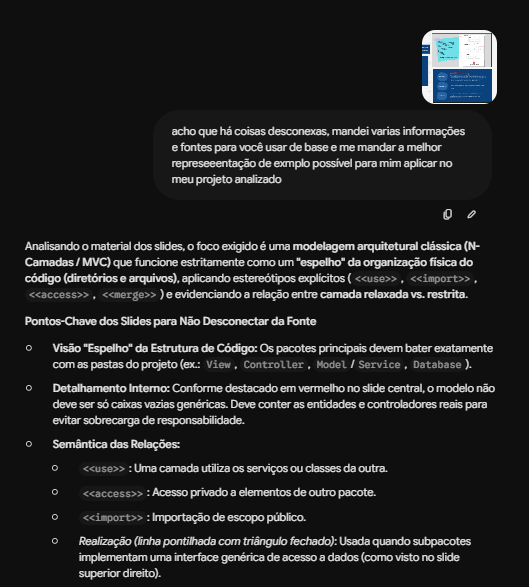
            </a>
            <figcaption>
                <p style="text-align: center; font-size: 10pt;">
                    Figura 3: Análise dos materiais e slides da disciplina para modelagem em camadas refletindo a estrutura física do código. (Fonte: conversa de <a href="https://github.com/PedroGTG">Pedro Henrique</a> com a IA, 2026)
                </p>
            </figcaption>
        </figure>

    ??? note "Registro 4: Diferenciação e aplicação dos estereótipos import e access"

        <figure style="text-align: center;">
            <a href="../../../assets/subGrupo1/ia_pedro/IApacotes4.png" target="_blank" rel="noopener noreferrer">
                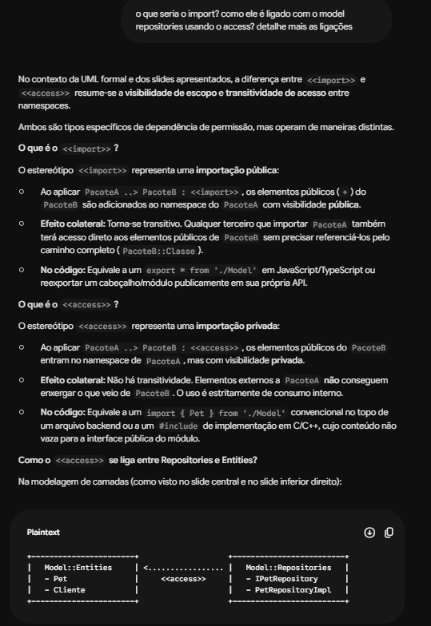
            </a>
            <figcaption>
                <p style="text-align: center; font-size: 10pt;">
                    Figura 4: Esclarecimento da diferença prática de visibilidade e transitividade entre os estereótipos import e access. (Fonte: conversa de <a href="https://github.com/PedroGTG">Pedro Henrique</a> com a IA, 2026)
                </p>
            </figcaption>
        </figure>

    ??? note "Registro 5: Regras de comunicação entre camadas e arquitetura restrita vs. relaxada"

        <figure style="text-align: center;">
            <a href="../../../assets/subGrupo1/ia_pedro/IApacotes5.png" target="_blank" rel="noopener noreferrer">
                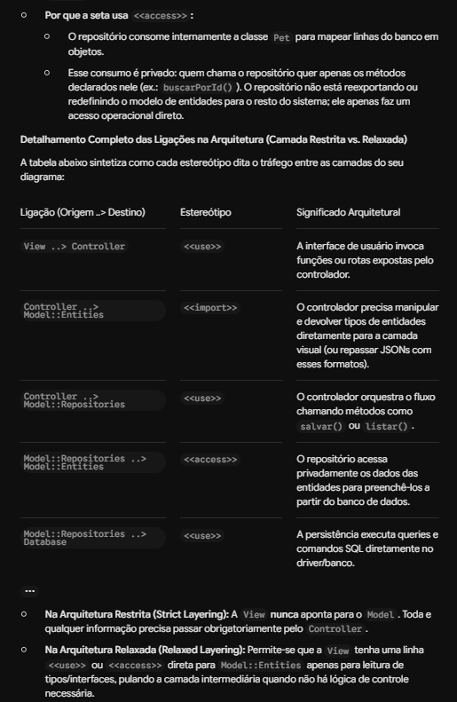
            </a>
            <figcaption>
                <p style="text-align: center; font-size: 10pt;">
                    Figura 5: Tabela síntese das conexões por camada e diretrizes de arquitetura restrita versus relaxada. (Fonte: conversa de <a href="https://github.com/PedroGTG">Pedro Henrique</a> com a IA, 2026)
                </p>
            </figcaption>
        </figure>


??? note "Diagrama de pacotes: Júlia Gabriella"

    <figure style="text-align: center;">
        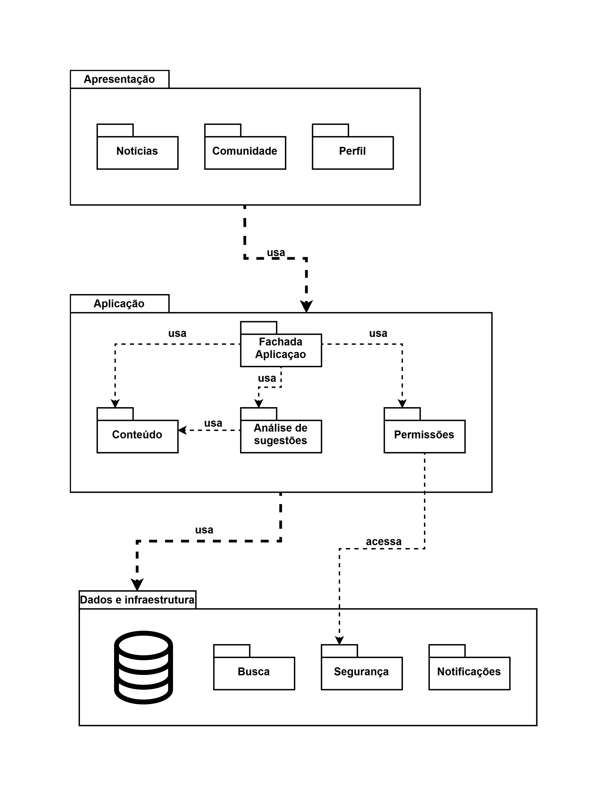
        <figcaption>
            <p style="text-align: center; font-size: 10pt;">
                Figura: Diagrama de pacotes Individual (Fonte: <a href="https://github.com/juliagabriellafs">Júlia Gabriella</a>, 2026)
            </p>
        </figcaption>
    </figure>

    Referências: [Package Diagrams - Overview (UML-diagrams.org)](https://www.uml-diagrams.org/package-diagrams-overview.html)

    **FOCO_03:**

    Antes de iniciar qualquer construção com apoio de IA, retomei os materiais disponibilizados na disciplina sobre diagramas de pacotes, incluindo as videoaulas, que ajudaram a esclarecer melhor a notação e o propósito de cada tipo de dependência (uso e importação). Como já tinha um entendimento consolidado do conceito antes de recorrer à ferramenta, o uso da IA nesse processo funcionou mais como apoio à organização das ideias do que como fonte de explicação do conteúdo.

    Utilizei o Gemini e o NotebookLM em conjunto: no NotebookLM, anexei os PDFs e os slides da disciplina referentes ao conteúdo de diagramas de pacotes, para manter a ferramenta contextualizada sobre o material de aula, e também contextualizei ambas as ferramentas sobre as funcionalidades do portal de notícias que o nosso grupo está desenvolvendo. Antes de pedir qualquer sugestão de estrutura, iniciei uma discussão para verificar se a IA compreendia corretamente o que é um diagrama de pacotes, fazendo perguntas sobre os elementos da notação e sobre as diferenças entre dependência de uso e de importação.

    A partir dessa contextualização, pedi ao Gemini que propusesse uma estrutura de pacotes para o portal de notícias. O processo ocorreu em etapas: primeiro, a ferramenta apresentou uma proposta em formato de texto, organizando os pacotes por camadas (Apresentação, Aplicação e Dados e Infraestrutura) e descrevendo as responsabilidades de cada um; em seguida, pedi que essa estrutura fosse apresentada de forma mais visual; por fim, solicitei que o Gemini gerasse uma imagem do diagrama, para que eu tivesse uma referência visual mais intuitiva antes de desenhar minha própria versão.

    As sugestões recebidas foram usadas como ponto de partida, não como resultado final: revisei os pacotes propostos, ajustei nomes e responsabilidades e defini as relações de uso entre as camadas de Apresentação, Aplicação e Dados e Infraestrutura de acordo com o que fazia sentido para o portal de notícias, considerando também o que foi discutido com o restante do subgrupo. Meu uso de IA, portanto, consistiu numa dinâmica de estudo, contextualização, discussão, geração de possibilidades e apoio visual, e não de reprodução direta das sugestões recebidas.

    [Consultar a conversa completa com o Gemini](https://share.gemini.google/EGhtAj5iqhfj)

    **Evidências do uso de IA**

    Os registros abaixo são trechos selecionados da conversa com o Gemini e mostram sugestões durante a elaboração, não a versão final do diagrama.

    ??? note "Registro 1: Sugestão inicial de estrutura de pacotes"

        <figure style="text-align: center;">
            <a href="../../../assets/subGrupo1/ia_julia/pacotesJuliaGemini.PNG" target="_blank" rel="noopener noreferrer">
                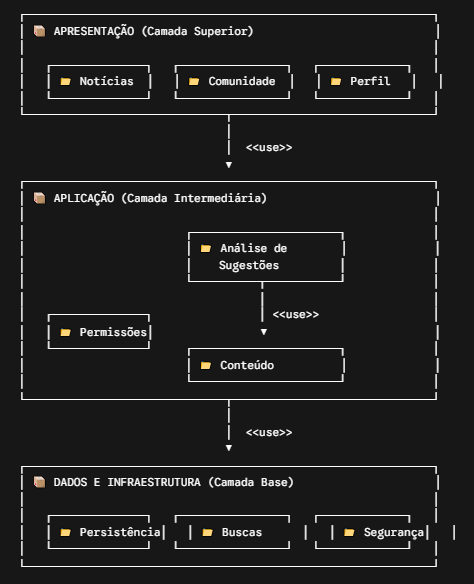
            </a>
            <figcaption>
                <p style="text-align: center; font-size: 10pt;">
                    Figura 1: Sugestão do Gemini para a estrutura de pacotes do portal, organizada por camadas. (Fonte: conversa de <a href="https://github.com/juliagabriellafs">Júlia Gabriella</a> com o Gemini, 2026)
                </p>
            </figcaption>
        </figure>

    ??? note "Registro 2: Geração de imagem do diagrama de pacotes"

        <figure style="text-align: center;">
            <a href="../../../assets/subGrupo1/ia_julia/pacotesJuliaGemini2.PNG" target="_blank" rel="noopener noreferrer">
                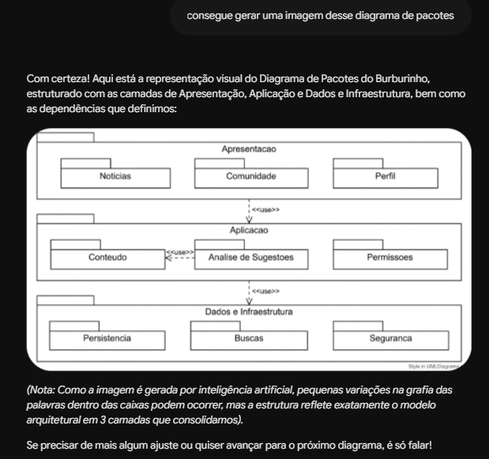
            </a>
            <figcaption>
                <p style="text-align: center; font-size: 10pt;">
                    Figura 2: Pedido de geração de uma imagem do diagrama de pacotes e resposta visual do Gemini. (Fonte: conversa de <a href="https://github.com/juliagabriellafs">Júlia Gabriella</a> com o Gemini, 2026)
                </p>
            </figcaption>
        </figure>

#### Insights diagrama de pacotes

- A comparação das propostas individuais trouxe diferentes formas de organizar o portal e ajudou a construir uma visão conjunta do sistema.
- A separação entre serviços de usuários anônimos e autenticados destacou a importância de considerar os perfis de acesso na organização das funcionalidades.
- A consolidação mostrou que agrupar funcionalidades em pacotes exige compreender suas responsabilidades e justificar as dependências entre eles.
- Os pacotes de infraestrutura evidenciaram que o planejamento do portal também precisa considerar segurança, busca e desempenho.

### FOCO_02: Modelagem Dinâmica

### Participantes no Foco_02

| Participantes                     |
| --------------------------------- |
| GIOVANNA AGUIAR DE BRITO          |
| JOAO PEDRO LOPES DA CRUZ          |
| JULIA GABRIELLA FERREIRA SIQUEIRA |
| PEDRO HENRIQUE FERREIRA XAVIER    |

### Metodologia do Foco_02

Para a elaboração dos diagramas de atividades, o grupo optou por distribuir entre os integrantes diferentes funcionalidades e fluxos do portal de notícias. A intenção foi ampliar a cobertura das funcionalidades da plataforma, evitando que todos os integrantes detalhassem uma mesma funcionalidade e, consequentemente, permitindo uma visão mais abrangente do funcionamento do portal.

Cada integrante ficou responsável por explorar um fluxo associado a uma funcionalidade ou perspectiva de usuário diferente. Dessa forma, foram considerados diferentes cenários de utilização da plataforma, como: a perspectiva do jornalista; o fluxo de um novo usuário acessando a plataforma; o usuário que deseja sugerir uma publicação; o usuário que deseja acessar eventos; o usuário que apenas acessa a plataforma e salva conteúdos de acordo com suas preferências.

Durante essa análise, alguns fluxos inicialmente considerados foram posteriormente descartados ou modificados, à medida que o grupo avaliava sua aderência ao escopo do projeto. Esse processo permitiu identificar possibilidades de interação que não haviam sido consideradas inicialmente e também reconhecer situações em que determinado fluxo não se mostrava adequado para a solução proposta.

Ao final, o grupo avaliou a possibilidade de unificar todos os fluxos em um único diagrama de atividades. Entretanto, devido à diversidade de funcionalidades e às diferentes perspectivas de utilização exploradas por cada integrante, concluiu-se que a unificação comprometeria a clareza e o detalhamento das representações.

Assim, foi mantida uma organização composta por diagramas específicos para os diferentes fluxos, permitindo representar cada funcionalidade de maneira mais adequada e preservar as particularidades dos cenários analisados.

### Diagrama de atividades

Diagramas de atividades representando os fluxos de sugestão de publicação e de tratamento de notícias no portal.

??? note "Diagrama de atividades do fluxo de sugerir publicação"

    <figure style="text-align: center;">
        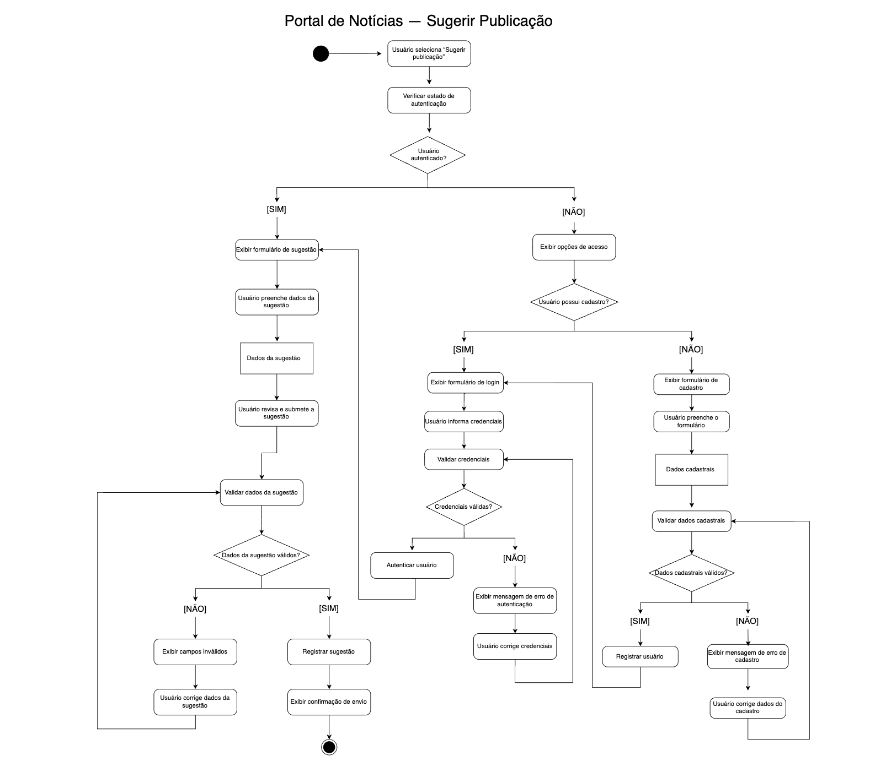
        <figcaption>
            <p style="text-align: center; font-size: 10pt;">
                Figura: Fluxo de sugerir publicação (Fonte: <a href="https://github.com/giovannabrito19">Giovanna Aguiar</a>, 2026)
            </p>
        </figcaption>
    </figure>

    Referências: [UML Activity Diagrams](https://www.uml-diagrams.org/activity-diagrams.html)

    **FOCO_03:**

    Utilizei o ChatGPT como apoio para compreender os elementos do diagrama de atividades e organizar o fluxo de sugerir publicação no portal de notícias. Os registros da conversa mostram explicações relacionadas ao material da aula, incluindo nós inicial e final, ações, decisões, união de caminhos e execução paralela. Esse apoio ajudou a relacionar os conceitos da modelagem dinâmica às etapas do processo que eu estava representando.

    A ferramenta também sugeriu uma sequência de ações para o fluxo, desde a seleção da opção de sugerir publicação até a validação dos dados e a confirmação do envio. As orientações incluíram a verificação de autenticação, os caminhos alternativos para credenciais inválidas e os retornos para correção de dados. Assim, o apoio da IA envolveu tanto explicações sobre a notação quanto propostas concretas para organizar o diagrama.

    Um ponto importante dessa consulta foi perceber que uma sequência sugerida pela IA precisa ser conferida antes de ser incorporada ao modelo. Em um dos esboços de autenticação, por exemplo, o caminho de erro não deixa clara a volta para uma nova validação; na versão apresentada, esse retorno está explícito. Por isso, o uso da ferramenta exige atenção tanto à clareza das decisões e dos retornos quanto ao escopo do processo representado.

    **Descrição do fluxo:**

    O fluxo começa quando o usuário seleciona “Sugerir publicação”. O sistema verifica sua autenticação e, quando necessário, apresenta as opções de login ou cadastro, com validação e correção dos dados. Após o acesso, o usuário preenche, revisa e submete a sugestão. O sistema valida os dados e permite sua correção quando há erros; quando os dados são válidos, registra a sugestão e confirma o envio, encerrando o fluxo.

    [Consultar a conversa completa com o ChatGPT](https://chatgpt.com/share/6aac100a-5254-83e9-a94e-8431293e969b)

    **Evidências do uso de IA**

    Os registros abaixo são trechos selecionados da conversa e apresentam explicações e sugestões durante a elaboração do diagrama. Clique no título para expandir cada registro e na imagem para ampliá-la.

    ??? note "Registro 1: Elementos do diagrama de atividades"

        <figure style="text-align: center;">
            <a href="../../../assets/subGrupo1/ia_gi/ia5.png" target="_blank" rel="noopener noreferrer">
                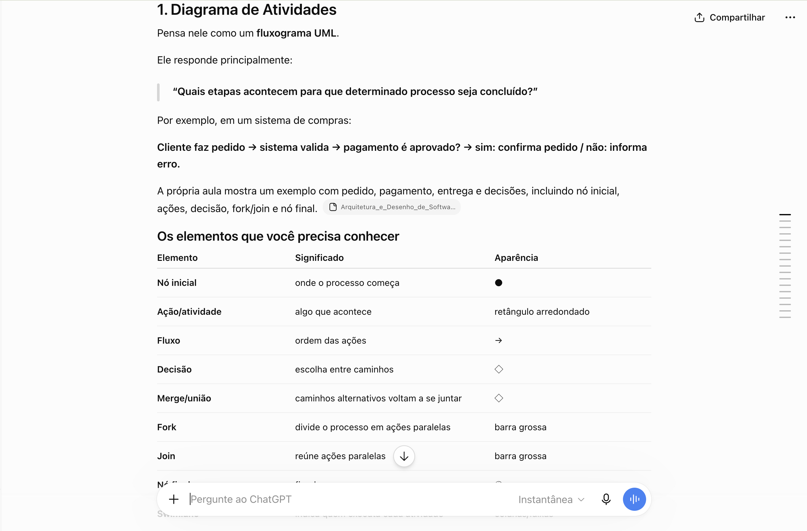
            </a>
            <figcaption>
                <p style="text-align: center; font-size: 10pt;">
                    Figura 1: Explicação dos elementos UML utilizados em diagramas de atividades. (Fonte: conversa de <a href="https://github.com/giovannabrito19">Giovanna Aguiar</a> com o ChatGPT, 2026)
                </p>
            </figcaption>
        </figure>

    ??? note "Registro 2: Proposta de autenticação"

        <figure style="text-align: center;">
            <a href="../../../assets/subGrupo1/ia_gi/ia6.png" target="_blank" rel="noopener noreferrer">
                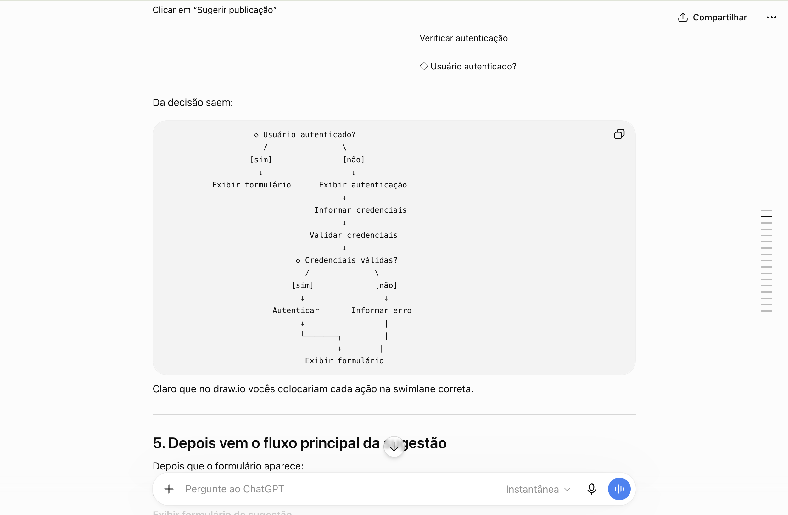
            </a>
            <figcaption>
                <p style="text-align: center; font-size: 10pt;">
                    Figura 2: Esboço de autenticação sugerido pelo ChatGPT durante a elaboração do fluxo. (Fonte: conversa de <a href="https://github.com/giovannabrito19">Giovanna Aguiar</a> com o ChatGPT, 2026)
                </p>
            </figcaption>
        </figure>

    ??? note "Registro 3: Sequência do fluxo e delimitação do escopo"

        <figure style="text-align: center;">
            <a href="../../../assets/subGrupo1/ia_gi/ia7.png" target="_blank" rel="noopener noreferrer">
                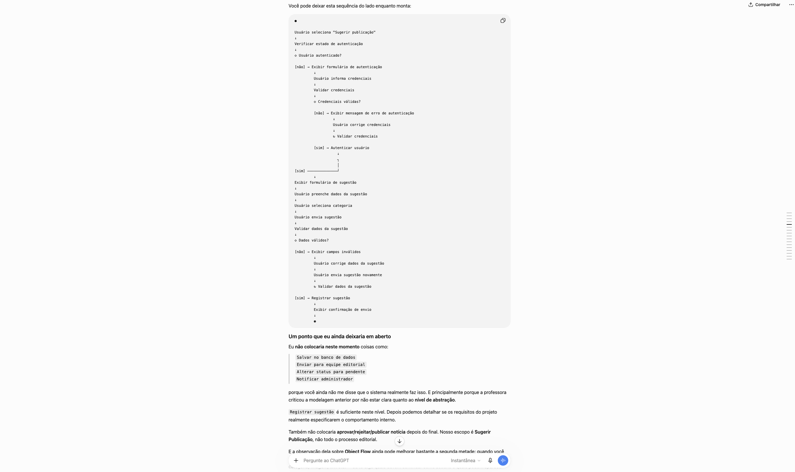
            </a>
            <figcaption>
                <p style="text-align: center; font-size: 10pt;">
                    Figura 3: Proposta textual do fluxo de sugerir publicação e observações sobre seu escopo. (Fonte: conversa de <a href="https://github.com/giovannabrito19">Giovanna Aguiar</a> com o ChatGPT, 2026)
                </p>
            </figcaption>
        </figure>

??? note "Diagrama de atividades: Pedro Henrique"

    <figure style="text-align: center;">
        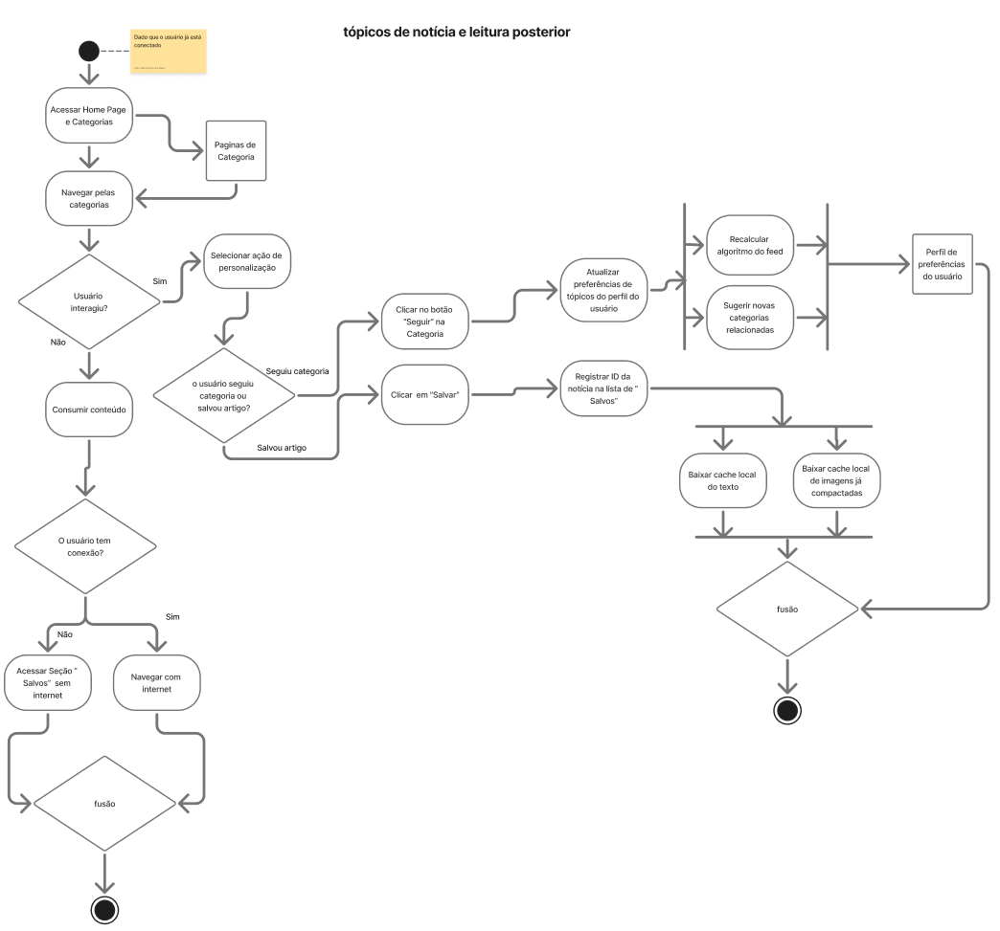
        <figcaption>
            <p style="text-align: center; font-size: 10pt;">
                Figura: Diagrama de atividades Individual (Fonte: <a href="https://github.com/PedroGTG">Pedro Henrique</a>, 2026)
            </p>
        </figcaption>
    </figure>

    Referências: [UML Activity Diagrams](https://www.uml-diagrams.org/activity-diagrams.html)
    [Tutorial de Diagrama de Atividades - Lucid](https://lucid.co/pt/diagrama/uml/tutorial-de-diagrama-de-atividades)
    [Vídeo sobre Diagrama de Atividades](https://www.youtube.com/watch?v=-d9bg1rZNhk)
    [Vídeo sobre Diagrama de Atividades](https://www.youtube.com/watch?v=HBJvuhkX-Vs)

    **FOCO_03:**

    Utilizei a inteligência artificial generativa para auxiliar no estudo da notação dos diagramas de atividades UML e no mapeamento dos fluxos de processos do portal de notícias. Durante a interação, busquei esclarecer conceitos notacionais sobre a utilização de nós de decisão, mesclagem (*merge*), barramentos de sincronização (*fork/join*) e particionamento do fluxo por meio de raias (*swimlanes*).

    Entretanto, o uso da ferramenta exigiu elevado senso crítico, pois em diversos momentos a IA induziu a erros notacionais e de modelagem arquitetural que precisaram ser corrigidos manualmente:

    - **Divisão de raias (Sistema vs. Leitor)**: A IA recomendou explicitamente dividir as raias em "Sistema" e "Leitor". Essa orientação é incorreta do ponto de vista arquitetural, pois "Sistema" abrange a totalidade da aplicação, enquanto o correto é especificar a responsabilidade do subsistema ou componente concreto que está atuando na etapa.
    - **Conexão direta entre diamantes**: A ferramenta sugeriu e aceitou a ligação direta entre dois nós de decisão/mesclagem (diamantes) sem nenhuma ação intermediária entre eles, o que violava o fluxo de controle e prejudicava a clareza da modelagem.
    - **Nó de objeto desconexo**: A IA afirmou inicialmente que um nó de objeto (*Object Node*) poderia ficar desconexo no diagrama. Na notação UML formal, um objeto não pode ficar solto ou flutuante; ele precisa obrigatoriamente ter uma aresta de entrada (produção/modificação) e uma aresta de saída direcionada a uma ação que o consome.

    Essas inconsistências evidenciaram que as respostas da IA não devem ser aceitas de forma passiva. Para validar o modelo e identificar as falhas sugeridas pela IA, foi fundamental recorrer a outras fontes de consulta, como os slides da matéria, tutoriais de apoio e vídeos do YouTube sobre diagramas de atividades. Esse confronto entre as orientações da ferramenta e as fontes de referência permitiu corrigir a nomeação das raias, ajustar a conexão dos diamantes e garantir a correta amarração dos nós de objeto segundo a especificação formal da UML.

    [Consultar a conversa completa com o Gemini](https://share.gemini.google/BzMCk5FcfRlT)

    **Evidências do uso de IA**

    Os registros abaixo apresentam trechos selecionados das conversas com a IA generativa durante o estudo e elaboração do diagrama de atividades.

    ??? note "Registro 1: Elementos centrais - Diamantes (Decisão/Mesclagem) vs. Barramentos (Fork/Join)"

        <figure style="text-align: center;">
            <a href="../../../assets/subGrupo1/ia_pedro/atividade1.png" target="_blank" rel="noopener noreferrer">
                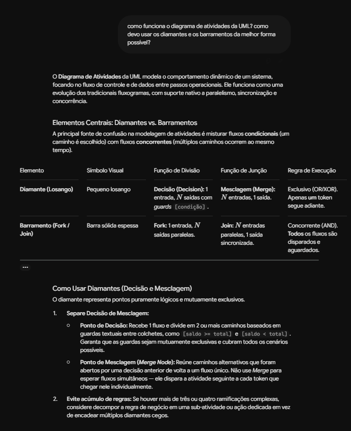
            </a>
            <figcaption>
                <p style="text-align: center; font-size: 10pt;">
                    Figura 1: Esclarecimento da IA sobre nós de decisão, mesclagem (Merge) e barramentos de sincronização (Fork/Join). (Fonte: conversa de <a href="https://github.com/PedroGTG">Pedro Henrique</a> com a IA, 2026)
                </p>
            </figcaption>
        </figure>

    ??? note "Registro 2: Discussão sobre nós de objeto (Object Nodes) desconexos"

        <figure style="text-align: center;">
            <a href="../../../assets/subGrupo1/ia_pedro/atividade2.png" target="_blank" rel="noopener noreferrer">
                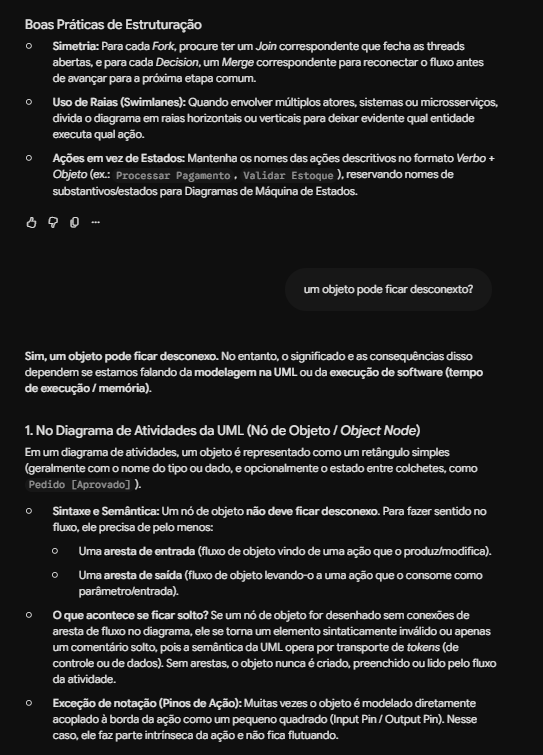
            </a>
            <figcaption>
                <p style="text-align: center; font-size: 10pt;">
                    Figura 2: Consulta à IA sobre a possibilidade de nós de objeto ficarem desconexos no fluxo do diagrama. (Fonte: conversa de <a href="https://github.com/PedroGTG">Pedro Henrique</a> com a IA, 2026)
                </p>
            </figcaption>
        </figure>

    ??? note "Registro 3: Múltiplas entradas em nós de mesclagem e sincronização"

        <figure style="text-align: center;">
            <a href="../../../assets/subGrupo1/ia_pedro/atividade4.png" target="_blank" rel="noopener noreferrer">
                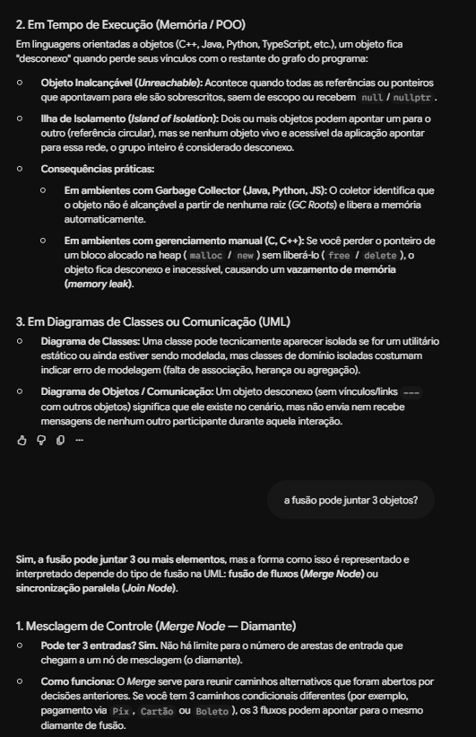
            </a>
            <figcaption>
                <p style="text-align: center; font-size: 10pt;">
                    Figura 3: Explicação sobre fusão de múltiplos fluxos em Merge Nodes e sincronização via Join Nodes. (Fonte: conversa de <a href="https://github.com/PedroGTG">Pedro Henrique</a> com a IA, 2026)
                </p>
            </figcaption>
        </figure>

    ??? note "Registro 4: Exemplos de implementação em notação Mermaid para Merge e Join"

        <figure style="text-align: center;">
            <a href="../../../assets/subGrupo1/ia_pedro/atividade5.png" target="_blank" rel="noopener noreferrer">
                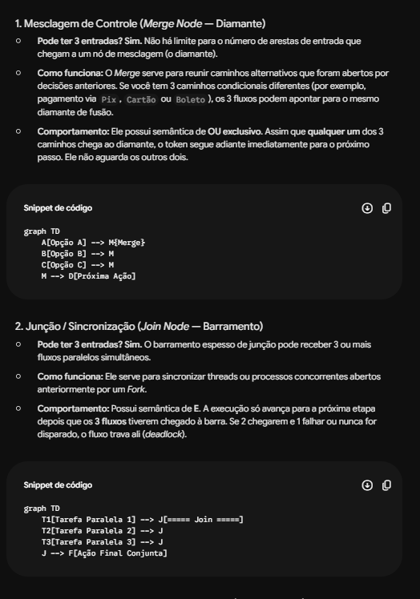
            </a>
            <figcaption>
                <p style="text-align: center; font-size: 10pt;">
                    Figura 4: Snippets fornecidos pela IA demonstrando o comportamento sintático de mesclagem e sincronização paralela. (Fonte: conversa de <a href="https://github.com/PedroGTG">Pedro Henrique</a> com a IA, 2026)
                </p>
            </figcaption>
        </figure>

    ??? note "Registro 5: Tratamento de dados/objetos e múltiplos nós de encerramento"

        <figure style="text-align: center;">
            <a href="../../../assets/subGrupo1/ia_pedro/atividade6.png" target="_blank" rel="noopener noreferrer">
                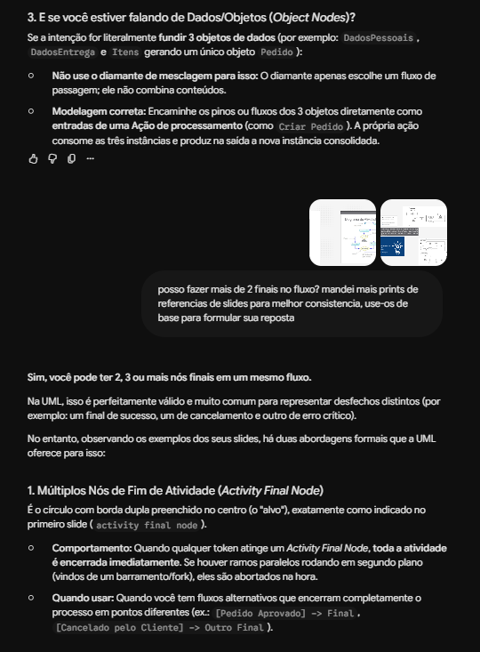
            </a>
            <figcaption>
                <p style="text-align: center; font-size: 10pt;">
                    Figura 5: Orientações sobre direcionamento de objetos para ações e uso de múltiplos Activity Final Nodes. (Fonte: conversa de <a href="https://github.com/PedroGTG">Pedro Henrique</a> com a IA, 2026)
                </p>
            </figcaption>
        </figure>

    ??? note "Registro 6: Proposta de divisão de raias (Swimlanes) entre Sistema e Leitor"

        <figure style="text-align: center;">
            <a href="../../../assets/subGrupo1/ia_pedro/atividade7.png" target="_blank" rel="noopener noreferrer">
                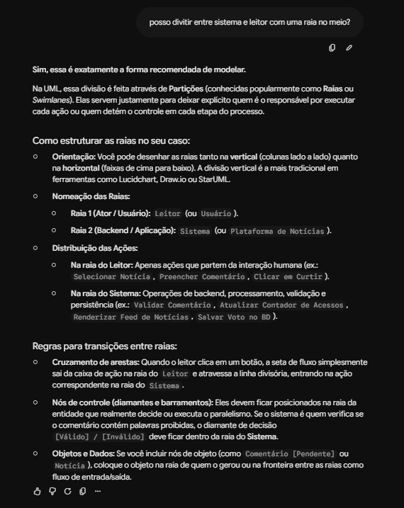
            </a>
            <figcaption>
                <p style="text-align: center; font-size: 10pt;">
                    Figura 6: Recomendação da IA sugerindo a partição do diagrama em raias de 'Sistema' e 'Leitor', induzindo ao erro de escopo. (Fonte: conversa de <a href="https://github.com/PedroGTG">Pedro Henrique</a> com a IA, 2026)
                </p>
            </figcaption>
        </figure>

    ??? note "Registro 7: Exemplo de diagrama de atividades gerado pela IA generativa"

        <figure style="text-align: center;">
            <a href="../../../assets/subGrupo1/ia_pedro/atividade_exemploIAgerado.png" target="_blank" rel="noopener noreferrer">
                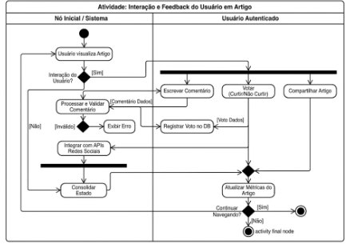
            </a>
            <figcaption>
                <p style="text-align: center; font-size: 10pt;">
                    Figura 7: Diagrama de atividades gerado pela ferramenta para demonstrar o fluxo de interação e feedback do usuário. (Fonte: conversa de <a href="https://github.com/PedroGTG">Pedro Henrique</a> com a IA, 2026)
                </p>
            </figcaption>
        </figure>

??? note "Diagrama de atividades do fluxo de aprovação de uma notícia pelo jornalista"

    <figure style="text-align: center;">
        
        <figcaption>
            <p style="text-align: center; font-size: 10pt;">
                Figura: Fluxo da aprovação de uma notícia pelo jornalista (Fonte: <a href="https://github.com/ojplc">João Pedro</a>, 2026)
            </p>
        </figcaption>
        <p style="text-align: left;">FOCO_03:<br>
        Para esse modelo eu optei por não usar inteligência artificial, não confio na IA para determinar fluxos, ainda mais quando regras de negócio estão envolvidas</p>
    </figure>

??? note "Diagrama de atividades do fluxo de eventos e calendário"

    <figure style="text-align: center;">
        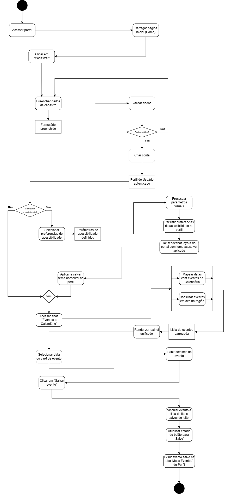
        <figcaption>
            <p style="text-align: center; font-size: 10pt;">
                Figura: Fluxo de cadastro, configuração de acessibilidade e acesso a eventos e calendário (Fonte: <a href="https://github.com/juliagabriellafs">Júlia Gabriella</a>, 2026)
            </p>
        </figcaption>
    </figure>

    Referências: [Activity Diagrams (UML-diagrams.org)](https://www.uml-diagrams.org/activity-diagrams.html)

    **FOCO_03:**

    O uso de IA generativa para o desenvolvimento do meu diagrama de atividades consistiu principalmente em explorar possibilidades de fluxos. Como cada integrante do grupo ficou responsável por seguir um fluxo diferente, inicialmente desenvolvi o meu diagrama de maneira autônoma. Entretanto, percebi que a estrutura que eu estava construindo estava ficando muito semelhante àquela que os meus colegas estavam desenvolvendo.

    Dessa forma, tive uma discussão com o NotebookLM para realizar a contextualização sobre o conceito de diagrama de atividades. Anexei ao NotebookLM os materiais da disciplina e o protótipo do grupo, para que a ferramenta ficasse contextualizada tanto sobre a notação quanto sobre o projeto que estávamos desenvolvendo, e pedi sugestões de possíveis fluxos dentro do site que poderiam ser utilizados no diagrama.

    Nesse processo, mantive um senso crítico constante, pois a IA não possui acesso aos nossos protótipos nem ao escopo completo do projeto. Consequentemente, algumas das sugestões apresentadas incluíam funcionalidades que não existem na plataforma ou que não fazem parte do escopo que estamos desenvolvendo, e por isso nem todas foram aplicáveis ao projeto.

    Apesar disso, algumas sugestões foram interessantes e serviram como ponto de partida para novas discussões. A partir delas, considerei um fluxo relacionado a um perfil de usuário que poderia ter sido deixado de lado: o dos usuários que optam por utilizar as ferramentas de acessibilidade. Além disso, como inicialmente estávamos dando maior atenção aos fluxos relacionados às notícias, percebi que a plataforma também possui a parte de eventos, e decidi explorar essa funcionalidade e desenvolver o meu fluxo seguindo essa linha de raciocínio.

    Inicialmente, pedi à IA que apresentasse os fluxos em formato textual, para facilitar a visualização das possibilidades antes de realizar a representação no diagrama. Depois da reunião com o grupo, percebi também que havia deixado de detalhar adequadamente os objetos presentes no fluxo de eventos, e usei novamente o NotebookLM para ajustar o fluxo e alinhá-lo ao que de fato existe no protótipo, removendo etapas que não correspondiam ao escopo real do projeto, como a inscrição em um evento. A ferramenta apresentou sugestões e, após analisá-las, acatei apenas parte delas, utilizando-as como apoio para revisar e atualizar o meu diagrama.

    Assim como no desenvolvimento do diagrama de pacotes, o uso da IA generativa não consistiu em simplesmente reproduzir uma resposta gerada pela ferramenta. A IA foi utilizada como instrumento de exploração, discussão e validação de possibilidades, enquanto as decisões finais sobre os fluxos, objetos e elementos representados foram realizadas a partir da minha compreensão dos conceitos estudados e das características reais do projeto.

    [NotebookLM](https://notebook.google.com/notebook/6b2bf70f-871c-4180-afbd-d0c7b5f35061)

    **Evidências do uso de IA**

    Os registros abaixo são trechos selecionados da interação com o NotebookLM e mostram sugestões de fluxo em formato textual e o ajuste do fluxo de eventos para alinhá-lo ao protótipo do grupo, não a versão final do diagrama.

    ??? note "Registro 1: Sugestão textual do fluxo de cadastro e validação"

        <figure style="text-align: center;">
            <a href="../../../assets/subGrupo1/ia_julia/atividadesJuliaNLM2.PNG" target="_blank" rel="noopener noreferrer">
                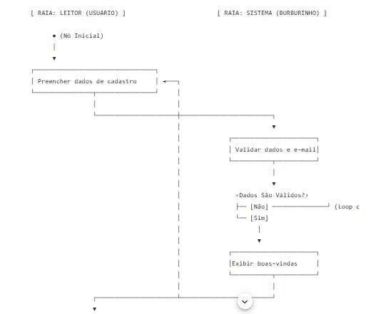
            </a>
            <figcaption>
                <p style="text-align: center; font-size: 10pt;">
                    Figura 1: Sugestão do NotebookLM para o fluxo de cadastro e validação de dados, em formato textual. (Fonte: conversa de <a href="https://github.com/juliagabriellafs">Júlia Gabriella</a> com o NotebookLM, 2026)
                </p>
            </figcaption>
        </figure>

    ??? note "Registro 2: Sugestão textual do fluxo de configuração de acessibilidade"

        <figure style="text-align: center;">
            <a href="../../../assets/subGrupo1/ia_julia/atividadesJuliaNLM3.PNG" target="_blank" rel="noopener noreferrer">
                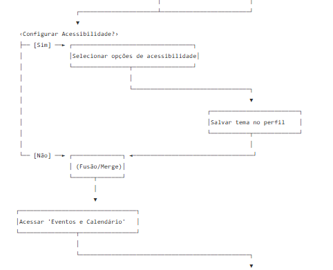
            </a>
            <figcaption>
                <p style="text-align: center; font-size: 10pt;">
                    Figura 2: Sugestão do NotebookLM para o fluxo de configuração de acessibilidade, em formato textual. (Fonte: conversa de <a href="https://github.com/juliagabriellafs">Júlia Gabriella</a> com o NotebookLM, 2026)
                </p>
            </figcaption>
        </figure>

    ??? note "Registro 3: Ajuste do fluxo de eventos para alinhar ao protótipo do grupo"

        <figure style="text-align: center;">
            <a href="../../../assets/subGrupo1/ia_julia/atividadesJuliaNLM.PNG" target="_blank" rel="noopener noreferrer">
                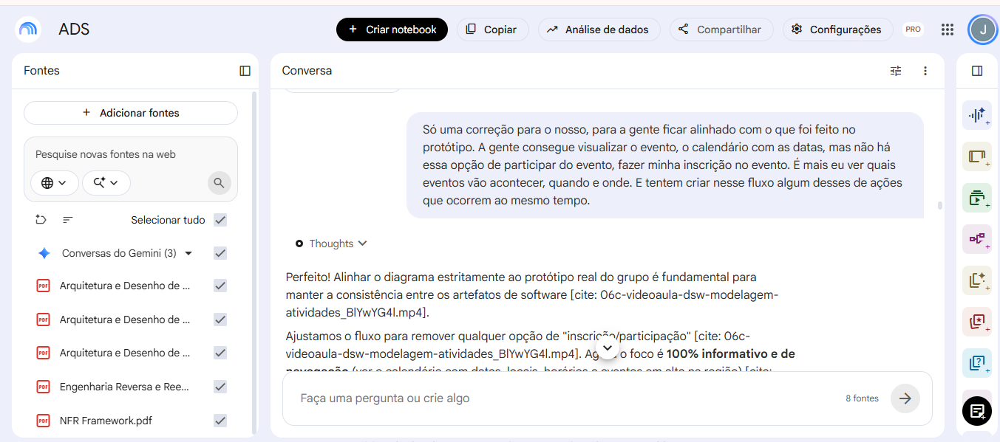
            </a>
            <figcaption>
                <p style="text-align: center; font-size: 10pt;">
                    Figura 3: Ajuste do fluxo de eventos e calendário para remover etapas que não existem no protótipo do grupo. (Fonte: conversa de <a href="https://github.com/juliagabriellafs">Júlia Gabriella</a> com o NotebookLM, 2026)
                </p>
            </figcaption>
        </figure>

### Insights diagrama de atividades

A análise dos diferentes fluxos possibilitou compreender que o portal de notícias não possui um único fluxo de utilização capaz de representar adequadamente todas as suas funcionalidades. A existência de diferentes perfis, objetivos e formas de interação resulta em caminhos distintos dentro da plataforma.

Um dos principais insights foi perceber a importância de analisar o sistema a partir de diferentes perspectivas de usuário. A experiência de um jornalista, por exemplo, possui necessidades e ações diferentes daquelas de um usuário que está acessando o portal pela primeira vez, sugerindo uma publicação, consultando eventos ou apenas consumindo e salvando conteúdos.

A exploração individual das funcionalidades também permitiu identificar fluxos possíveis que não haviam sido considerados inicialmente, além de possibilitar o descarte daqueles que não estavam alinhados ao escopo definido para o projeto. Dessa maneira, a elaboração dos diagramas funcionou não apenas como uma forma de documentação, mas também como uma ferramenta para analisar e validar o comportamento esperado da plataforma.

Outro insight importante foi a percepção de que nem sempre a unificação de diferentes funcionalidades em uma única representação resulta em uma documentação mais adequada. Neste caso, a diversidade dos fluxos tornou mais apropriada a separação dos diagramas, permitindo que cada cenário fosse representado com maior clareza e evitando que um único diagrama se tornasse excessivamente complexo.

Por fim, a análise dos protótipos no Figma em conjunto com a elaboração dos diagramas de atividades possibilitou uma compreensão mais detalhada da relação entre interface, ações do usuário, decisões e comportamentos do sistema. O processo contribuiu para identificar lacunas, revisar funcionalidades e compreender de forma mais concreta como os diferentes usuários poderiam interagir com o portal de notícias.
- A comparação das propostas individuais permitiu mapear os processos-chave do portal, abordando o fluxo de sugerir publicação (Giovanna), a moderação e aprovação jornalística (João Pedro) e o algoritmo de recomendação (Pedro). A proposta inicial de *salvamento de dados locais* foi reavaliada pela equipe e não adotada no processo consolidado, optando-se por manter a persistência e o controle de dados centralizados na infraestrutura do portal.
- A discussão no subgrupo reforçou a importância de definir raias (*swimlanes*) para delimitar os atores (Leitor, Jornalista) e os subsistemas/componentes concretos responsáveis por cada etapa. Apontou-se como crítica o uso de raias genéricas com o nome "Sistema", pois ocultam as responsabilidades reais e comprometem a granularidade do diagrama.
- O grupo destacou a necessidade de aplicar a notação UML com rigor, corrigindo equívocos como a ligação direta entre diamantes de decisão/mesclagem e a presença de nós de objetos (*Object Nodes*) desconexos. Além disso, reafirmou-se que fluxos com regras de negócio críticas (como a moderação jornalística) exigem validação humana e não devem depender unicamente de sugestões automatizadas de ferramentas ou IA.
-A análise conjunta evidenciou a importância de mapear detalhadamente os caminhos de exceção (como credenciais inválidas ou dados incorretos de publicação), garantindo retornos explícitos para etapas de correção antes do encerramento do processo.

### FOCO_03: IA Generativa

### Participantes no Foco_03

| Nome do Membro           | Lições Aprendidas                                                                                                                                                                                                                                                                                                                                                                                                    | Uso da IA Generativa (SENSO CRÍTICO)                                    |
| ------------------------ | -------------------------------------------------------------------------------------------------------------------------------------------------------------------------------------------------------------------------------------------------------------------------------------------------------------------------------------------------------------------------------------------------------------------- | ----------------------------------------------------------------------- |
| João Pedro Lopes da Cruz | Aprendi que a IA consegue fazer diagramas usando o mermaid, o que pode facilitar a centralização dos diagramas no repositório sem depender de ferramentas externas. Usando a IA aprendi um pouco sobre outros padrões arquiteturais enquanto pesquisava o diagrama de pacotes, ponderei as diferenças entre monolito, microsserviços, arquitetura em camadas e MVC para melhor determinar como executaria o diagrama | Uso de IA foi declarado logo a baixo dos diagramas realizados pelo João |
| Giovanna Aguiar de Brito | Aprendi a relacionar a organização dos pacotes às responsabilidades do sistema e a analisar se as dependências sugeridas fazem sentido para o portal. No diagrama de atividades, aprofundei a compreensão das decisões, dos caminhos alternativos e dos retornos para correção de dados. Percebi que compreender e justificar cada elemento é essencial para revisar as sugestões da IA. | Utilizei o ChatGPT como apoio passo a passo na elaboração dos diagramas de pacotes e atividades, junto aos materiais da disciplina e às referências indicadas. Questionei sugestões, busquei esclarecer os conceitos e revisei a proposta de pacotes após a discussão com a equipe. As respostas da ferramenta exigiram análise quanto à notação, ao escopo e às regras do projeto. Os relatos de uso, os links das conversas e os registros estão nas respectivas seções dos diagramas. |
| Júlia Gabriella Ferreira Siqueira | Aprendi que contextualizar bem a IA sobre a disciplina, o projeto e os materiais usados é essencial para que as sugestões recebidas façam sentido; sem isso, a ferramenta tende a propor funcionalidades ou estruturas fora do escopo real do que estamos desenvolvendo. Usei a IA principalmente como instrumento de exploração e discussão de possibilidades, tanto na organização dos pacotes quanto na definição dos fluxos de atividades, confrontando sempre as sugestões com os materiais da disciplina, os protótipos e as decisões do grupo. Pedir diferentes formas de representação, como estruturas textuais e visuais, ajudou a comparar alternativas antes de decidir a versão final. A IA também foi útil para identificar elementos que eu poderia ter esquecido, como o fluxo de acessibilidade e a definição mais completa dos objetos do diagrama de atividades. Em ambos os processos, mantive senso crítico constante e as decisões finais partiram da minha própria análise, e não da reprodução automática das respostas da ferramenta. | Utilizei o Gemini e o NotebookLM como apoio na elaboração dos diagramas de pacotes e de atividades, sempre contextualizando as ferramentas com os materiais da disciplina, os slides e o protótipo do grupo. Pedi sugestões de estrutura e de fluxos, questionei os elementos propostos e descartei aqueles que não correspondiam ao escopo real do portal, incorporando apenas o que fazia sentido após revisão. Os relatos de uso, os links das conversas e os registros de evidência estão nas respectivas seções dos diagramas. |
| Pedro Henrique Ferreira Xavier | A IA foi capaz de gerar bons diagramas de atividades e de casos de uso, entretanto, foi necessário revisar as propostas, pois em vários pontos eles tinham inconsistências, como fluxos que não se conectavam e informações desnecessárias. O processo de interação com a IA foi um aprendizado, pois percebi que o resultado depende de como você questiona e direciona a ferramenta.   | Meu uso de IA foi para auxiliar na elaboração dos diagramas de caso de uso e atividades. Foi necessário revisar diversas vezes os diagramas, pois a IA apresentava algumas inconsistências. Além disso, percebi que devo ser mais específico nas perguntas para ter resultados mais consistêntes e , também, providenciar mais contexto para minimizar chances de erros. |


## Versionamentos

| Nome do Membro           | Contribuição                     | Data       |
| ------------------------ | -------------------------------- | ---------- |
| Joao Pedro Lopes da Cruz | Acrescenta artefatos individuais | 16/09/2026 |
| Giovanna Aguiar de Brito | Adiciona artefatos individuais de pacotes e atividades | 17/09/2026 |
| Giovanna Aguiar de Brito | Adiciona Diagrama de Pacotes da Equipe e Metodologia e Insights do Foco 1 | 17/09/2026 |
| Giovanna Aguiar de Brito | Atualiza o diagrama de pacotes da equipe e melhora sua qualidade e visualização em SVG. | 17/09/2026 |
| Júlia Gabriella Ferreira Siqueira | Adiciona artefatos individuais, Metodologia e Insigts do Foco 2. | 17/09/2026 |
| Pedro Henrique Ferreira Xavier | Adiciona artefatos individuais e uso da IA| 17/09/2026 |   
