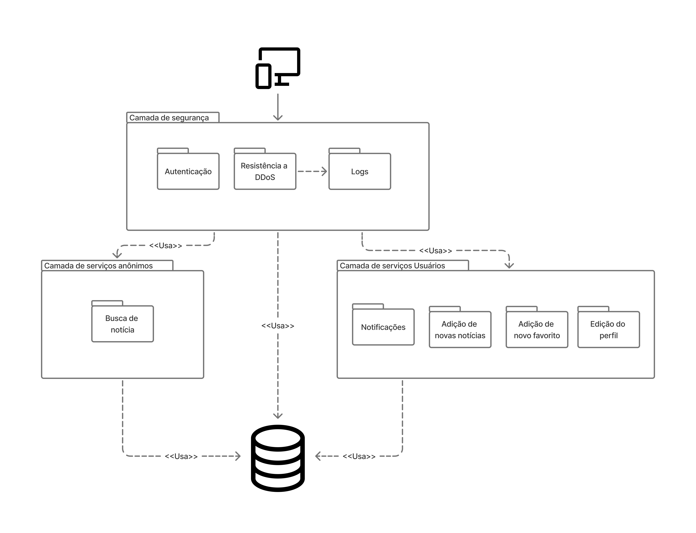
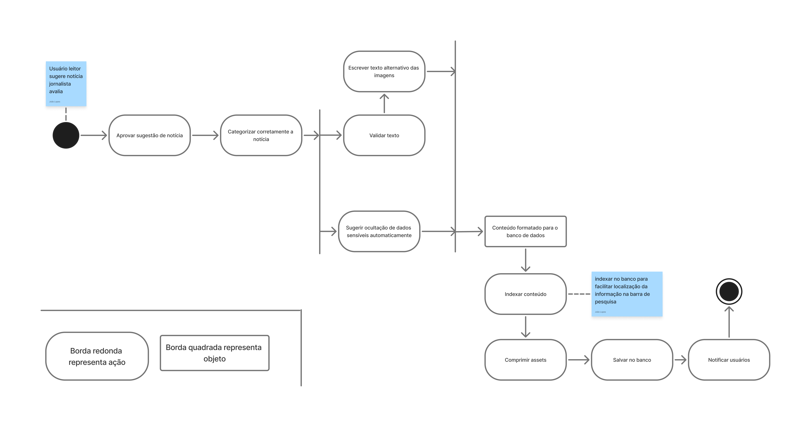

# SubEquipe_01

## Focos do Relatório
### FOCO_01: Modelagem Estática
### Participantes no Foco_01
|Participantes|
|---------------|
| GIOVANNA AGUIAR DE BRITO | 
| JOAO PEDRO LOPES DA CRUZ | 
| JÚLIA GABRIELLA FERREIRA SIQUEIRA | 
| PEDRO HENRIQUE FERREIRA XAVIER |

### Metodologia do Foco_01

Escrevam melhor

### Diagrama de pacotes 
Diagrama de pacotes com a visão consolidada do subgrupo sobre o domínio estudado.

<figure style="text-align: center;">
    
    <figcaption>
        

            Figura: Diagrama de pacotes do Grupo (Fonte: SubEquipe 01, 2026)
        

    </figcaption>
</figure>

??? note "Diagrama de pacotes: João Pedro"

    <figure style="text-align: center;">
        
        <figcaption>
            

                Figura: Diagrama de pacotes Individual (Fonte: <a href="https://github.com/ojplc">João Pedro</a>, 2026)
            

        </figcaption>
    </figure>

??? note "Diagrama de pacotes: Giovanna Aguiar"

    <figure style="text-align: center;">
        
        <figcaption>
            

                Figura: Diagrama de pacotes Individual (Fonte: <a href="https://github.com/giovannabrito19">Giovanna Aguiar</a>, 2026)
            

        </figcaption>
    </figure>

??? note "Diagrama de pacotes: Pedro Henrique"

    <figure style="text-align: center;">
        
        <figcaption>
            

                Figura: Diagrama de pacotes Individual (Fonte: <a href="https://github.com/PedroGTG">Pedro Henrique</a>, 2026)
            

        </figcaption>
    </figure>

??? note "Diagrama de pacotes: Júlia Gabriella"

    <figure style="text-align: center;">
        
        <figcaption>
            

                Figura 1: Diagrama de pacotes Individual (Fonte: <a href="https://github.com/juliagabriellafs">Júlia Gabriella</a>, 2026)
            

        </figcaption>
    </figure>

#### Insights diagrama de pacotes
- xxxxx
- xxxxx

### FOCO_02: Modelagem Dinâmica

### Participantes no Foco_02
|Participantes|
|---------------|
| GIOVANNA AGUIAR DE BRITO | 
| JOAO PEDRO LOPES DA CRUZ | 
| JULIA GABRIELLA FERREIRA SIQUEIRA | 
| PEDRO HENRIQUE FERREIRA XAVIER |

### Metodologia do Foco_02

Escrevam melhor a metodologia aqui

### Diagrama de atividades
Diagrama de atividades representando diferentes fluxos da apresentação

??? note "Diagrama de atividades do fluxo de aprovação de uma notícia pelo jornalista"

    <figure style="text-align: center;">
        
        <figcaption>
            

                Figura: Fluxo da aprovação de uma notícia pelo jornalista (Fonte: <a href="https://github.com/ojplc">João Pedro</a>, 2026)
            

        </figcaption>
    </figure>

### Insights diagrama de atividades
- xxxx
- xxxx

### FOCO_03: IA Generativa
### Participantes no Foco_03

| Nome do Membro | Lições Aprendidas | Uso da IA Generativa (SENSO CRÍTICO) |
| -------- | ----- | ----------- |

## Versionamentos
|Nome do Membro | Contribuição | Data
| -------- | ----- | ----------- |
| Joao Pedro Lopes da Cruz | Acrescenta artefatos individuais | 16/09/2026 |
