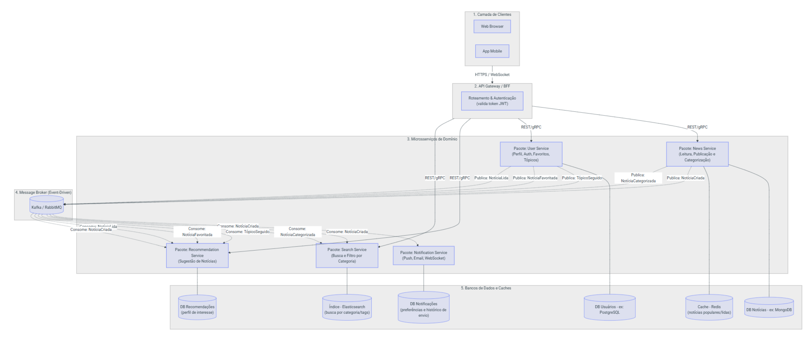

# SubEquipe_01

## Focos do Relatório
### FOCO_01: Modelagem Estática
### Participantes no Foco_01
|Participantes|
|---------------|
| GIOVANNA AGUIAR DE BRITO | 
| JOAO PEDRO LOPES DA CRUZ | 
| JÚLIA GABRIELLA FERREIRA SIQUEIRA | 
| PEDRO HENRIQUE FERREIRA XAVIER |

### Metodologia do Foco_01

Escrevam melhor

### Diagrama de pacotes 
Diagrama de pacotes com a visão consolidada do subgrupo sobre o domínio estudado.

<figure style="text-align: center;">
    
    <figcaption>
        

            Figura: Diagrama de pacotes do Grupo (Fonte: SubEquipe 01, 2026)
        

    </figcaption>
</figure>

??? note "Diagrama de pacotes: João Pedro"

    <figure style="text-align: center;">
        
        <figcaption>
            

                Figura: Diagrama de pacotes Individual (Fonte: <a href="https://github.com/ojplc">João Pedro</a>, 2026)
            

        </figcaption>
        
FOCO_03: 
        Usei a IA para ela me auxiliar a definir um padrão arquitetural adequado, eu tinha em mente que o MVC dos exemplos não seria suficiente para atender o site, tendo em vista que a ação de leitura seria muito maior que a da escrita e apenas o MVC não lidaria bem com a escalabilidade e muitos acessos simultâneos.
        IA sugeriu uma estrutura de múltiplos serviços (microsserviços) e foi nessa linha que eu decidi seguir, como a camada de dados será a mais utilizada ela poderá ser mais robusta, tolerando mais acessos, enquanto a camada de serviços pode ser um pouco menor
        Pedi para a IA gerar um diagrama de pacotes e passei as principais funcionalidades, ela me devolveu um código mermaid para visualização do diagrama. Contudo, a ferramenta não separou corretamente os microsserviços no desenho dela, colocando tudo em um bolo só, além disso não foram seguidas as regras de representação do diagrama (como os termos usa e importa da dependência, uso incorreto das setas e desenho de banco de dados).
        

        
        <figcaption>
            

                Figura: Diagrama de pacotes gerado pela IA (Fonte: Claude Antropic</a>, 2026)
            

        </figcaption>
        

        Ao fazer o meu próprio diagrama separei em camada de segurança, sendo ela a porta de entrada da aplicação, e as camadas de serviços anônimos e serviços do usuário logado, a ideia é que cada camada atue como um serviço próprio independente e que as camadas possam comunicar entre si.
        

    </figure>

??? note "Diagrama de pacotes: Giovanna Aguiar"

    <figure style="text-align: center;">
        
        <figcaption>
            

                Figura: Diagrama de pacotes Individual (Fonte: <a href="https://github.com/giovannabrito19">Giovanna Aguiar</a>, 2026)
            

        </figcaption>
    </figure>

??? note "Diagrama de pacotes: Pedro Henrique"

    <figure style="text-align: center;">
        
        <figcaption>
            

                Figura: Diagrama de pacotes Individual (Fonte: <a href="https://github.com/PedroGTG">Pedro Henrique</a>, 2026)
            

        </figcaption>
    </figure>

??? note "Diagrama de pacotes: Júlia Gabriella"

    <figure style="text-align: center;">
        
        <figcaption>
            

                Figura 1: Diagrama de pacotes Individual (Fonte: <a href="https://github.com/juliagabriellafs">Júlia Gabriella</a>, 2026)
            

        </figcaption>
    </figure>

#### Insights diagrama de pacotes
- xxxxx
- xxxxx

### FOCO_02: Modelagem Dinâmica

### Participantes no Foco_02
|Participantes|
|---------------|
| GIOVANNA AGUIAR DE BRITO | 
| JOAO PEDRO LOPES DA CRUZ | 
| JULIA GABRIELLA FERREIRA SIQUEIRA | 
| PEDRO HENRIQUE FERREIRA XAVIER |

### Metodologia do Foco_02

Escrevam melhor a metodologia aqui

### Diagrama de atividades
Diagrama de atividades representando diferentes fluxos da apresentação

??? note "Diagrama de atividades do fluxo de aprovação de uma notícia pelo jornalista"

    <figure style="text-align: center;">
        
        <figcaption>
            

                Figura: Fluxo da aprovação de uma notícia pelo jornalista (Fonte: <a href="https://github.com/ojplc">João Pedro</a>, 2026)
            

        </figcaption>
        
FOCO_03: 
        Para esse modelo eu optei por não usar inteligência artificial, não confio na IA para determinar fluxos, ainda mais quando regras de negócio estão envolvidas

    </figure>

### Insights diagrama de atividades
- xxxx
- xxxx

### FOCO_03: IA Generativa
### Participantes no Foco_03

| Nome do Membro | Lições Aprendidas | Uso da IA Generativa (SENSO CRÍTICO) |
| -------- | ----- | ----------- |
| João Pedro Lopes da Cruz | Aprendi que a IA consegue fazer diagramas usando o mermaid, o que pode facilitar a centralização dos diagramas no repositório sem depender de ferramentas externas. Usando a IA aprendi um pouco sobre outros padrões arquiteturais enquanto pesquisava o diagrama de pacotes, ponderei as diferenças entre monolito, microsserviços, arquitetura em camadas e MVC para melhor determinar como executaria o diagrama | Uso de IA foi declarado logo a baixo dos diagramas realizados pelo João |

## Versionamentos
|Nome do Membro | Contribuição | Data
| -------- | ----- | ----------- |
| Joao Pedro Lopes da Cruz | Acrescenta artefatos individuais | 16/09/2026 |
