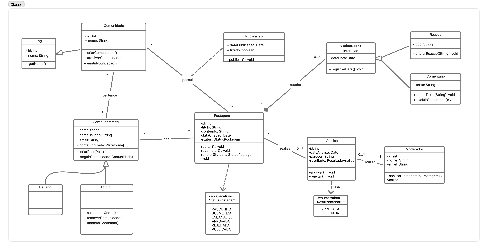
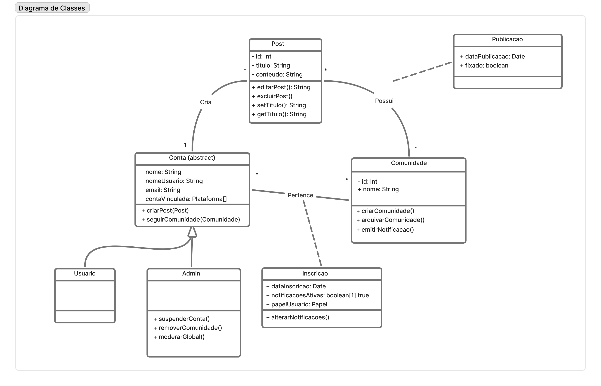
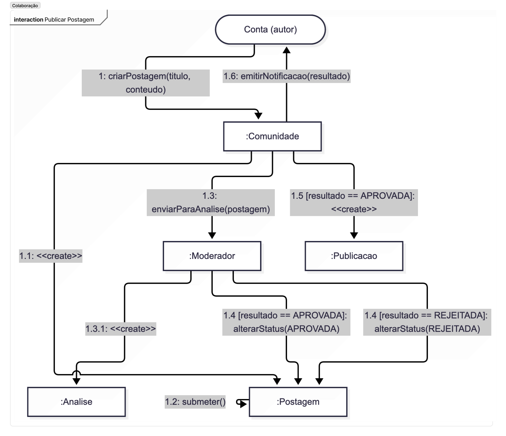
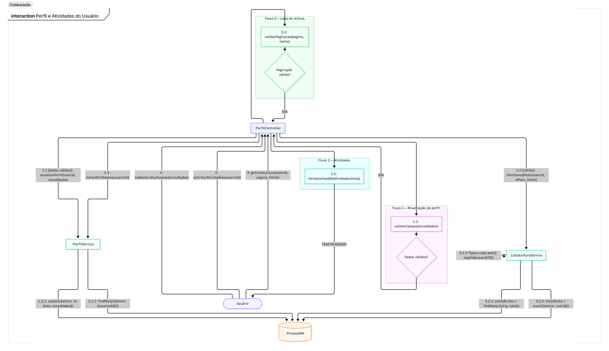
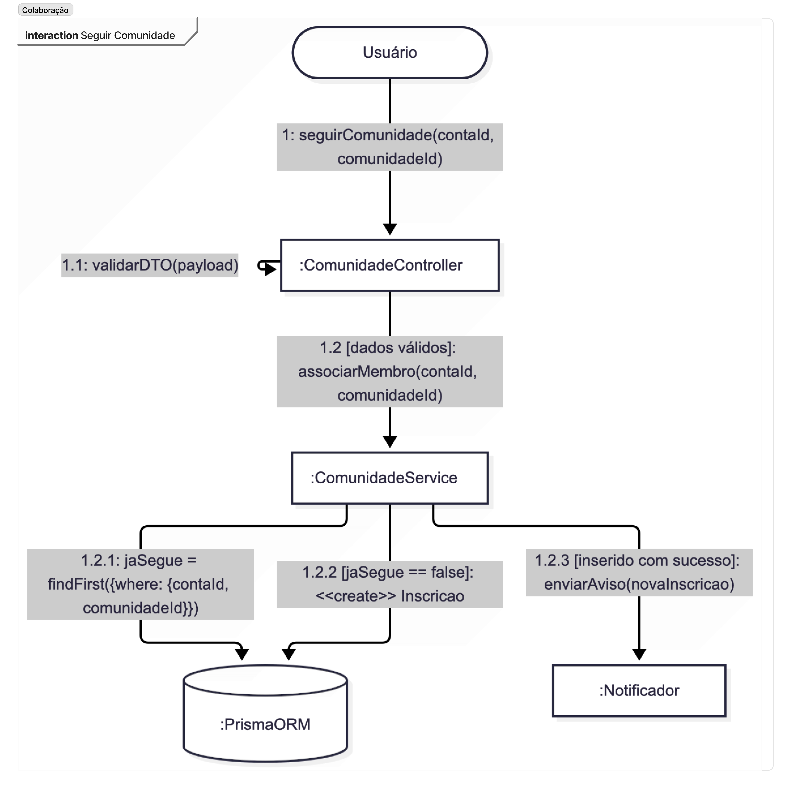
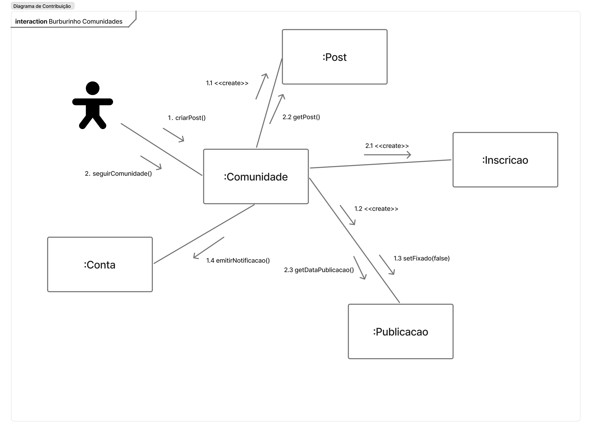

# SubEquipe_02
O relatório deverá conter a estrutura de focos estabelecida a seguir, bem como versionamentos, metodologia e participantes por foco.
Não omitir tópicos.

## Focos do Relatório:
### FOCO_01: Modelagem Estática
Entrega Mínima: um modelo estático, na notação UML.
Mira-se no MM no FOCO, com a entrega mínima.
#### Participantes no Foco_01
| Nome do Membro | Matrícula |
|---|---|
|Matheus Eiki Kimura| 241025327|
|Luís Felipe Parreira Cunha| 241011401|

#### Metodologia do Foco_01
O trabalho foi dividido inicialmente entre os integrantes, que modelaram recortes diferentes do Portal de Notícias. Cada diagrama foi apresentado e discutido em reunião, permitindo comparar classes, atributos, operações e relacionamentos. Em seguida, a equipe unificou os conceitos equivalentes, removeu duplicidades e ajustou as responsabilidades das classes. Como resultado, o modelo consolidado reúne contas, comunidades, postagens, publicações, interações e o processo de análise e moderação em uma única visão do domínio.
#### Diagrama de Classes
<figure style="text-align: center;">
    
    <figcaption>
        

            Figura: Diagrama de classes consolidado do Subgrupo 2 (Fonte: SubEquipe 02, 2026)
        

    </figcaption>
</figure>

##### Analise do Fluxo do diagrama consolidado
??? note "Analise do Fluxo do diagrama consolidado"
    O diagrama consolidado organiza o domínio do Portal de Notícias em torno da classe abstrata Conta, que concentra os dados e comportamentos comuns às contas. Usuario e Admin especializam essa classe, permitindo distinguir as ações de um usuário comum das operações administrativas, como suspender contas, remover comunidades e moderar conteúdo.
    Uma Conta pode criar várias Postagens. A Postagem representa o conteúdo em elaboração, com título, conteúdo, data de criação e status controlado pela enumeração StatusPostagem. Antes de se tornar pública, ela é submetida à análise de um Moderador. A classe Analise registra a data, o parecer e o resultado da avaliação, representado pela enumeração ResultadoAnalise. Essa separação preserva o histórico de moderação e torna rastreável a decisão tomada sobre cada postagem.
    Quando o resultado da análise é APROVADA, a postagem pode originar uma Noticia e ser representada como conteúdo público. Em caso de REJEITADA, o fluxo de publicação é interrompido. A Comunidade organiza postagens e pode emitir notificações, enquanto a classe Inscricao registra a participação de uma conta, incluindo data de inscrição, papel e preferência de notificações.
    O modelo também contempla as interações dos usuários com as publicações. A classe Interacao generaliza as ações realizadas sobre uma publicação, como Reacao e Comentario, permitindo registrar diferentes formas de participação sem misturar seus atributos e comportamentos. Assim, o diagrama relaciona o ciclo de criação, moderação e publicação com os recursos de comunidade e interação social.

---

#### Foco 1 - Matheus Eiki Kimura

##### Diagrama de Classes
<figure style="text-align: center;">
    
    <figcaption>
        

            Figura: Diagrama de classes - Eiki (Fonte: SubEquipe 02, 2026)
        

    </figcaption>
</figure>

##### Processo de Construção
??? note "Processo de Construção"
    Antes de desenhar o diagrama, comecei pensando em qual interação do Portal de Notícias realmente merecia ser modelada: não fazia sentido representar o sistema inteiro, então escolhi o fluxo de submissão e moderação de conteúdo, por ser o coração de qualquer plataforma UGC. Para entender melhor como esse tipo de fluxo costuma funcionar na prática, pesquisei brevemente como sites como o Reddit e o dev.to tratam a publicação de conteúdo gerado por usuários: no Reddit, posts passam por filtros automáticos e moderação humana (moderadores de subreddit) antes de ficarem totalmente visíveis; no dev.to, artigos submetidos também passam por uma etapa de revisão editorial/comunitária antes de entrarem em destaque. Essa investigação me ajudou a confirmar que o papel do "moderador" como objeto separado do "sistema" fazia sentido, já que em ambos os casos a decisão de aprovar ou rejeitar não é automática, mas depende de um agente humano com autonomia própria. Também percebi que esses sites tratam a notícia/post publicado como uma entidade distinta da postagem original (rascunho vs. conteúdo publicado), o que me levou a manter postagem e noticia como objetos separados no diagrama, e não como um único objeto que muda de estado. Depois disso, segui o roteiro do enunciado, mas pensando sempre em quem se comunica com quem, evitando cair na tentação de desenhar um diagrama de sequência (que seria mais natural pra mim, já que é o que mais pratiquei em aula) ou um diagrama de classes disfarçado. Por fim, usei as guard conditions para representar a bifurcação aprovado/rejeitado, inspirado justamente na ideia de que, como no Reddit, conteúdo rejeitado simplesmente não segue adiante no fluxo — por isso não existe mensagem para noticia nesse ramo.

##### Analise do Fluxo do diagrama
??? note "Analise do Fluxo do diagrama"
    O sistema modela o ciclo de vida completo de uma notícia gerada por usuários: da criação da postagem até sua publicação, sempre passando por moderação obrigatória.
    Usuario e Postagem. Um Usuario é responsável apenas por criar e submeter conteúdo — seus métodos criarPostagem() e submeterPostagem() deixam claro que ele não tem poder de decisão sobre o que é publicado. O resultado da sua ação é uma Postagem, que carrega o conteúdo bruto (titulo, conteudo, dataCriacao) e, principalmente, um atributo status do tipo StatusPostagem (RASCUNHO, SUBMETIDA, EM_ANALISE, APROVADA, REJEITADA, PUBLICADA). É esse atributo — e não uma regra externa — que expressa dentro do próprio objeto que nenhuma publicação é automática. A relação Usuario–Postagem é 1 — 0..*: um usuário pode ter zero, uma ou várias postagens, mas cada postagem tem exatamente um autor.
    Moderador e Analise. Nenhuma postagem avança sem passar pelo crivo de um Moderador. O resultado dessa avaliação, porém, não é gravado como um simples atributo da postagem — ele vira uma instância própria de Analise, com dataAnalise, parecer e resultado (tipado pela enumeração ResultadoAnalise: APROVADA ou REJEITADA). Essa separação existe porque o domínio exige preservar o histórico de moderação: quem analisou, quando e com qual justificativa, mesmo depois que a postagem já mudou de estado. A relação Postagem–Analise é 1 — 0.., pois uma postagem pode ainda não ter sido analisada (enquanto está em rascunho, por exemplo) ou pode acumular mais de uma análise ao longo do tempo (reenvios, reavaliações). Da mesma forma, Moderador–Analise é 1 — 0..: um moderador realiza várias análises, mas cada análise pertence a um único moderador.
    De Postagem a Noticia. Só quando uma Analise resulta em aprovação a postagem pode dar origem a uma Noticia — a classe que representa o conteúdo já publicado, com seus próprios atributos (titulo, conteudo, dataPublicacao) e o método publicar(). Aqui está a decisão de modelagem mais importante do diagrama: optou-se por uma associação entre Postagem e Noticia (multiplicidade 1 — 0..1), e não por herança. A razão é conceitual: Postagem e Noticia não são o mesmo objeto em dois momentos, mas dois papéis diferentes — um mutável e sujeito a avaliação, outro estável e público. Se Noticia herdasse de Postagem, o modelo passaria a sugerir que toda postagem é, em potencial, uma notícia, o que conflitaria com o próprio controle feito pelo atributo status. Com a associação, a multiplicidade 0..1 já basta para garantir que uma postagem gera no máximo uma notícia, e só depois de aprovada; uma postagem rejeitada simplesmente nunca preenche esse lado da relação. Isso também preserva o rastro de auditoria da postagem original, que continua existindo mesmo depois de ter originado a notícia publicada.
    As enumerações StatusPostagem e ResultadoAnalise cumprem o papel de evitar que estados centrais do domínio sejam representados por texto livre, sujeito a inconsistência — apenas valores previstos e válidos podem ocorrer, o que torna explícitas as transições possíveis do processo.
    Em síntese, o diagrama conta a seguinte história: um Usuario cria e submete uma Postagem; ela aguarda e passa por uma ou mais rodadas de Analise, conduzidas por um Moderador; se aprovada, pode então gerar uma Noticia, tornando-se conteúdo público. Em nenhum ponto do modelo existe um caminho que permita a uma postagem virar notícia sem antes passar pela moderação — o que atende diretamente ao requisito central do sistema: toda notícia publicada carrega, por trás de si, um histórico de análise registrado e rastreável.

##### Fontes
??? note "Fontes"
    As fontes utilizadas foram os slides passados em sala e disponiveis no aprender e o site oficial da UML: https://www.uml-diagrams.org/class-diagrams-overview.html

---

#### Foco 1 - Luís Felipe Parreira Cunha

##### Diagrama de Classes
<figure style="text-align: center;">
    
    <figcaption>
        

            Figura: Diagrama de classes - Luís Felipe Parreira Cunha (Fonte: SubEquipe 02, 2026)
        

    </figcaption>
</figure>

##### Analise do Fluxo do diagrama
??? note "Analise do Fluxo do diagrama"
    O diagrama modela a organização do Portal de Notícias em torno das contas, das postagens e das comunidades. A classe abstrata Conta concentra os dados e comportamentos comuns aos diferentes tipos de conta, como nome, nome de usuário, e-mail, plataformas vinculadas, criação de posts e acompanhamento de comunidades. A especialização em Usuario e Admin representa a diferença entre uma conta comum e uma conta com responsabilidades administrativas, como suspender contas, remover comunidades e moderar o conteúdo global.
    A relação entre Conta e Post indica que uma conta pode criar várias postagens, enquanto cada post é criado por uma conta. A classe Post reúne os dados básicos do conteúdo, como identificador, título e conteúdo, além de operações para editar, excluir, alterar e consultar o título. A relação de posse entre Post e Comunidade representa a organização das postagens dentro de comunidades: uma comunidade pode reunir vários posts, e cada post está associado a uma comunidade no contexto representado pelo diagrama.
    A classe Comunidade representa um espaço de agrupamento e interação sobre um tema. Seus métodos permitem criar e arquivar a comunidade, além de emitir notificações aos participantes. A associação entre Conta e Comunidade é realizada por meio da classe Inscricao, que registra a participação de uma conta em uma comunidade. Essa classe guarda a data de inscrição, o papel do usuário e a preferência sobre notificações ativas, permitindo que cada participante tenha configurações próprias. O método alterarNotificacoes() torna explícita a possibilidade de ajustar essas preferências sem alterar os dados da comunidade.
    A classe Publicacao representa o conteúdo que foi efetivamente publicado. Sua associação com Post é opcional no fluxo indicado, pois um post pode existir antes de se tornar uma publicação. Os atributos dataPublicacao e fixado registram, respectivamente, quando o conteúdo foi publicado e se ele deve permanecer em destaque. Assim, o modelo diferencia o conteúdo criado e editável do conteúdo que já está disponível publicamente.
    Em síntese, uma Conta cria Posts e pode participar de Comunidades por meio de Inscricoes. Os administradores possuem operações adicionais para manter a organização e a moderação da plataforma, enquanto as comunidades agrupam posts e gerenciam notificações. Quando um post é publicado, ele passa a ser representado também como uma Publicacao, preservando a distinção entre o conteúdo em elaboração e o conteúdo público.

##### Processo de Construção
??? note "Processo de Construção"
    Para construir o diagrama, comecei delimitando o escopo nas funcionalidades de comunidade e nas relações entre contas e publicações. A primeira decisão foi criar a classe abstrata Conta para reunir os atributos e comportamentos compartilhados por usuários comuns e administradores, evitando duplicação e deixando explícita a especialização entre esses papéis. Em seguida, modelei Post como a entidade que representa o conteúdo criado por uma conta, com operações de edição, exclusão e alteração do título.
    Depois, acrescentei Comunidade para representar os espaços que agrupam publicações e permitem a emissão de notificações. A participação de uma conta em uma comunidade foi modelada por uma classe associativa, Inscricao, porque a relação precisa armazenar informações próprias, como data de inscrição, papel do usuário e preferência de notificações. Também separei Post de Publicacao para representar a diferença entre um conteúdo criado ou editável e o conteúdo já publicado, que possui data de publicação e pode ser fixado.
    Durante a elaboração, utilizei Inteligência Artificial como apoio para discutir nomenclaturas, verificar possibilidades de relacionamento e identificar inconsistências no primeiro rascunho. As sugestões foram revisadas pela equipe e ajustadas ao domínio do Portal de Notícias, especialmente na distinção entre as responsabilidades de Usuario e Admin e na substituição da ideia de moderação global por moderação de conteúdo. Por fim, o modelo foi apresentado na reunião do subgrupo e considerado junto aos diagramas dos demais integrantes para a consolidação do diagrama de classes.

---

### FOCO_02: Modelagem Dinâmica
Entrega Mínima: um modelo dinâmico, na notação UML.
Mira-se no MM no FOCO, com a entrega mínima.
#### Participantes no Foco_02
| Nome do Membro | Matrícula |
|---|---|
| Luís Felipe Parreira Cunha | 241011401 |
|Matheus Eiki Kimura| 241025327|

#### Metodologia do Foco_02
O modelo dinâmico foi elaborado a partir dos principais fluxos identificados no diagrama de classes e discutido na reunião do subgrupo. Cada integrante representou as mensagens trocadas entre os objetos de seu recorte funcional. Depois, os fluxos foram comparados para verificar a ordem das operações, as condições de sucesso e falha e a responsabilidade de cada objeto. A consolidação considerou os ajustes definidos pela equipe, mantendo a comunicação entre conta, postagem, comunidade, análise, publicação e serviços de persistência.
#### Modelo Dinâmico
O modelo dinâmico completo é composto pelos três diagramas de contribuição elaborados pelo subgrupo. Em conjunto, eles mostram a interação com publicações, a atualização do perfil e das atividades do usuário e o acompanhamento de comunidades.

##### Diagrama de Comunicação - Publicação de Postagem
<figure style="text-align: center;">
    
    <figcaption>
        

            Figura: Diagrama de comunicação de publicação de postagem (Fonte: SubEquipe 02, 2026)
        

    </figcaption>
</figure>

##### Diagrama de Comunicação - Perfil e Atividades
<figure style="text-align: center;">
    
    <figcaption>
        

            Figura: Diagrama de comunicação de perfil e atividades do usuário (Fonte: SubEquipe 02, 2026)
        

    </figcaption>
</figure>

##### Diagrama de Comunicação - Seguir Comunidade
<figure style="text-align: center;">
    
    <figcaption>
        

            Figura: Diagrama de comunicação de seguir comunidade (Fonte: SubEquipe 02, 2026)
        

    </figcaption>
</figure>

##### Analise dos Fluxos do subgrupo
??? note "Analise dos Fluxos do subgrupo"
    O conjunto de três diagramas dinâmicos descreve comportamentos complementares do Portal de Notícias. No fluxo de publicação de postagem, a Conta autora cria a Postagem e, após sua aprovação, a Publicacao pode ser criada e associada à Comunidade. A comunidade recebe a notificação do novo conteúdo, conectando a publicação ao espaço em que ela será acompanhada pelos participantes.
    O fluxo de perfil e atividades mostra a atualização dos dados do usuário, a consulta de postagens salvas e a listagem de atividades. O PerfilController valida os dados antes de solicitar a atualização e consulta os serviços responsáveis por recuperar e formatar os resultados. Quando os dados são inválidos, o processo é interrompido; quando são válidos, a alteração é persistida.
    No fluxo de seguir comunidade, o Usuario solicita a inscrição e o ComunidadeController valida a requisição. Se a conta já acompanha a comunidade, o sistema consulta a inscrição existente; caso contrário, cria uma nova Inscricao e registra a participação. Quando a inserção é concluída, um aviso pode ser enviado pelo Notificador. Em conjunto, os diagramas mostram mensagens, condições, retornos e responsabilidades distribuídas entre usuários, controladores, serviços e persistência.

---

#### Foco 2 - Luís Felipe Parreira Cunha

##### Modelo Dinâmico
<figure style="text-align: center;">
    
    <figcaption>
        

            Figura: Diagrama de comunicação - Luís Felipe Parreira Cunha (Fonte: SubEquipe 02, 2026)

---
#### Foco 2 - Matheus Eiki Kimura

##### Diagrama de Comunicação
<figure style="text-align: center;">
    
    <figcaption>
        

            Figura: Diagrama de comunicação - Eiki (Fonte: SubEquipe 02, 2026)
        

    </figcaption>
</figure>

##### Processo de Construção
??? note "Processo de Construção"
    Ao pensar na modelagem desse diagrama, comecei revisando como outras plataformas de conteúdo gerado por usuários lidam com o ciclo de vida de uma publicação. Olhei o Reddit, onde qualquer post entra no ar quase instantaneamente e a curadoria acontece depois, via upvotes e moderação comunitária reativa — um modelo que não fazia sentido aqui, já que o planejado pelo grupo exige aprovação prévia. O dev.to me pareceu uma referência mais próxima: lá o conteúdo também passa por triagem antes de ganhar destaque, embora a publicação em si já ocorra de forma mais aberta. Isso me ajudou a decidir que o núcleo do domínio giraria em torno de um status controlado (StatusPostagem), em vez de um simples booleano "publicado/não publicado", já que o processo tem etapas intermediárias reais. Pensei bastante também em separar Postagem de Noticia: notei que em fóruns como o Reddit o post e sua versão "aprovada" são o mesmo objeto, mas aqui, como existe moderação formal, fazia mais sentido tratar como papéis distintos, preservando histórico. A ideia da classe Analise surgiu justamente da necessidade de rastreabilidade, algo que vi discutido em sistemas editoriais tradicionais (tipo fluxos de revisão de artigos científicos), não tanto em UGC puro. No fim, tentei equilibrar simplicidade de domínio com fidelidade ao processo real de moderação.

##### Analise do Fluxo do diagrama
??? note "Analise do Fluxo do diagrama"
    A leitura segue estritamente a numeração, não a posição vertical dos elementos:
    1 – 2.1: usuario solicita a criação de uma postagem; sistema exibe o formulário (1.1); usuario submete título e conteúdo (2); sistema registra a postagem criando o objeto postagem (2.1).
    3 – 5: sistema encaminha a postagem para análise (3); moderador consulta as pendências (4) e realiza a análise sobre o objeto analise (5).
    6: moderador decide, respeitando as guard conditions [resultado == APROVADA] ou [resultado == REJEITADA] — apenas uma das duas mensagens ocorre por execução.
    7: sistema registra o resultado da análise (auto-mensagem).
    8 (fluxo de aprovação): sistema publica a notícia (auto-mensagem), cria o objeto noticia (8.1) e o próprio objeto noticia se publica (8.2 — auto-mensagem).
    8 (fluxo de rejeição): sistema apenas informa a rejeição (auto-mensagem) — note que, neste ramo, nenhuma mensagem para noticia é enviada, deixando explícito que conteúdo rejeitado não é publicado.
    9: sistema notifica o usuario sobre o resultado final, em ambos os fluxos.
    Relação com o Portal de Notícias UGC
    O diagrama modela o caminho crítico do conteúdo gerado pelo usuário (UGC) dentro do portal: da criação pelo usuario, passando pelo controle de qualidade exercido pelo moderador, até a eventual publicação como noticia. Ele evidencia que a atualidade do portal depende diretamente desse fluxo de moderação — só o conteúdo aprovado alimenta a seção de notícias — e que cada etapa (criação, encaminhamento, análise, decisão, registro e publicação) é uma comunicação distinta e ordenada entre instâncias, sem qualquer suposição sobre implementação técnica (HTTP, banco de dados, etc.), mantendo o diagrama no nível de domínio, como convém a um Diagrama de Comunicação UML.

##### Fontes
??? note "Fontes"
    As fontes utilizadas foram os slides passados em sala e disponiveis no aprender e o site oficial da UML: https://www.uml-diagrams.org/communication-diagrams.html

---

### FOCO_03: IA Generativa
Entrega Mínima: pontos de vista de cada membro da equipe sobre as lições aprendidas e uso da IA Generativa.
TODOS DEVEM PARTICIPAR!

#### Participantes no Foco_03
| Nome do Membro | Lições Aprendidas | Uso da IA Generativa (SENSO CRÍTICO) |
|---|---|---|
| Luís Felipe Parreira Cunha | Aprendi a relacionar a modelagem estática com a dinâmica, entendendo que as classes, responsabilidades e associações definidas no diagrama de classes precisam aparecer como mensagens coerentes nos fluxos de comunicação. Também compreendi melhor o uso de classes associativas, como Inscricao, para representar informações próprias de uma relação. | A IA Generativa foi útil para gerar um primeiro esboço dos relacionamentos, sugerir nomes de operações e ajudar a organizar os fluxos de publicação, moderação e participação em comunidades. Porém, as respostas apresentaram ambiguidades e precisaram ser revisadas, principalmente quanto às responsabilidades de Conta, Admin, Comunidade e Analise. A equipe comparou as sugestões com os requisitos do sistema e manteve apenas as decisões compatíveis com o domínio e com a notação UML. |
|Matheus Eiki Kimura|Trabalhar com o diagrama de classes e o de comunicação lado a lado deixou claro como visões estática e dinâmica se completam: o primeiro define quem são Postagem, Analise, Noticia e como se relacionam; o segundo mostrou a ordem exata das mensagens — como enviarParaAnalise(), registrarAnalise() e criarNoticia() — que dão vida a essas relações. Ver a guard condition [resultado == APROVADA] no diagrama de comunicação confirmou, na prática, a mesma regra que eu já tinha modelado como multiplicidade 0..1 entre Postagem e Noticia: nos dois casos, o fluxo de rejeição simplesmente não gera o objeto noticia. Pesquisar Reddit e dev.to antes de desenhar também reforçou, sob outro ângulo, a decisão de manter postagem e noticia separadas — percebi que ambos os sites tratam rascunho e conteúdo publicado como coisas distintas, não o mesmo objeto mudando de estado. No fim, entendi que um diagrama sozinho corre o risco de parecer arbitrário, mas quando estrutura e comportamento se confirmam mutuamente, a modelagem fica muito mais sólida e defensável.|No DIAGRAMA DE CLASSES a ia Criou corretamente as classes necessárias e conseguiu interligalas de maneira satisfátoria, porem repetiu caixas que já haviam sido criadas corretamente (Gerou duplicatas) e gerou também um diagrama de estados (acredito que tenha sido uma alucinação), ademais ela não usou notações como “- # +” para representar se os metodos são privados, publicos ou protegidos, percebendo esses erros eu corrigi-los. No DIAGRAMA DE COMUNICAÇÃO a IA generativa em primeira instância alucinou ao pedir por um diagrama de “colaboração”, porém ao utilizar o termo “comunicação” e passar fontes para que ela se basea-se (link da documentação oficical do UML-Diagrams e Slides da Aula) obteve maior sucesso, percebi que ela enfeitou de mais (colocou muitos icones) o que na minha opinião atrapalhou a vizualição e deixou menos profissional, porém de conteudo ficou satisfatório, ajustei a questão de icones para deixar mais “limpo”.|

---

## Versionamentos
| Nome do Membro | Contribuição | Data |
|---|---|---|
| Luís Felipe Parreira Cunha | 1. Elaboração do Diagrama de Classes; 2. Elaboração do Diagrama de Comunicação; 3. Descrição da metodologia dos focos; 4. Ponto de vista sobre as lições aprendidas e o uso da IA Generativa | 17/09/2026 |
|Matheus Eiki Kimura| Adição da contribuição Individual | 17/09/2026 |

---

# Observações: 
Entregável: Relatório, documentado no GitPages, revelando:
## Entrega Mínima (por subgrupo da equipe): um modelo estático na notação UML, um modelo dinâmico na notação UML, e pontos de vista de cada membro da equipe sobre as lições aprendidas e uso da IA Generativa. Mira-se no MM, com a entrega mínima.

## Como ir além, para conseguir menções superiores?
Embasar cada artefato gerado e cada decisão tomada na literatura;
Manter rastros claros para o trabalho em equipe (ex. vídeos das reuniões e atas bem elaboradas), evidenciando práticas metodológicas (ex. reuniões periódicas das metodologias ágeis; checklists; debates, e assim vai);
Usar os vários recursos de modelagem da notação UML, e
Reportar os pontos de vista de forma fundamentada, clara e com senso crítico.

## 📌A ideia não é quantidade, e sim qualidade do que é entregue.

## Apresentação:
Apresentação (para a professora) explicando o artefato elaborado, com: (i) rastro claro aos membros participantes (MOSTRAR QUADRO DE PARTICIPAÇÕES & COMMITS); (ii) justificativas & senso crítico sobre o trabalho realizado, e (iii) comentários gerais sobre o trabalho em equipe. Tempo da Apresentação: +/- 10min. Recomendação: Apresentar diretamente via Wiki ou GitPages do Projeto. Baixar os conteúdos com antecedência, evitando problemas de internet no momento de exposição nas Dinâmicas de Avaliação.

A Wiki ou GitPages do Projeto deve conter, PARA CADA SUBGRUPO, um tópico dedicado ao relatório com a entrega mínima, versionamentos, referências, e demais detalhamentos gerados pela equipe nesse escopo.
Demais orientações disponíveis nas Diretrizes (vide Aprender3).
