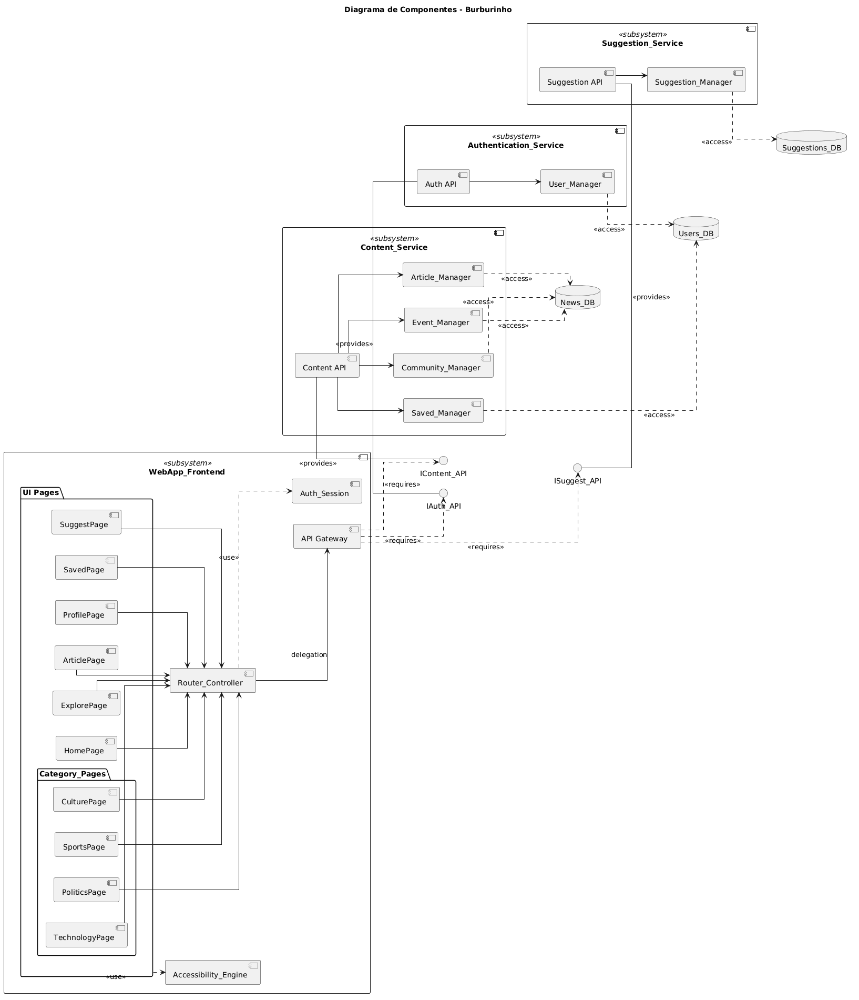
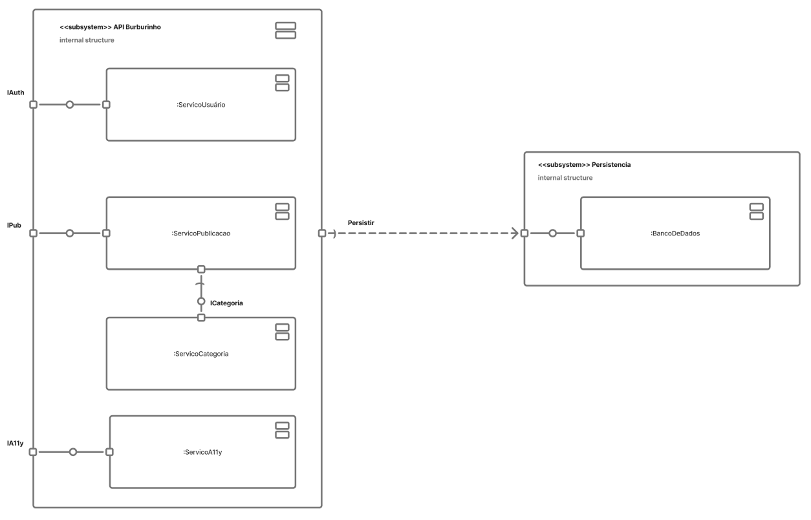
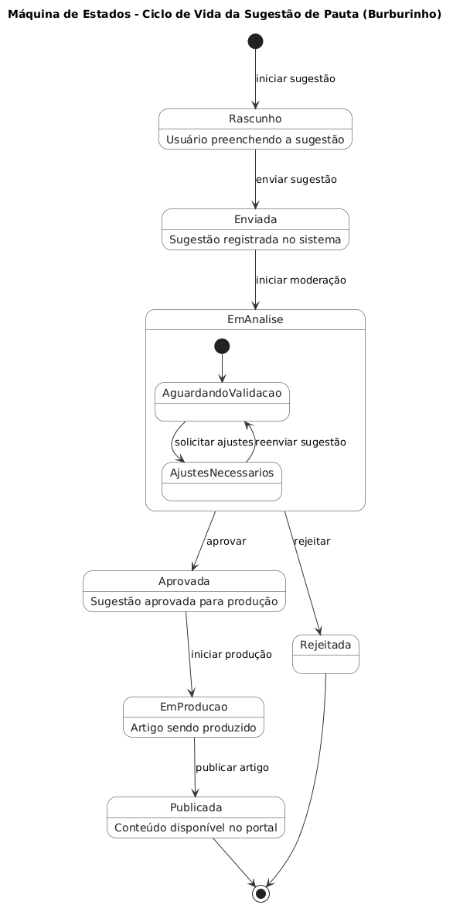
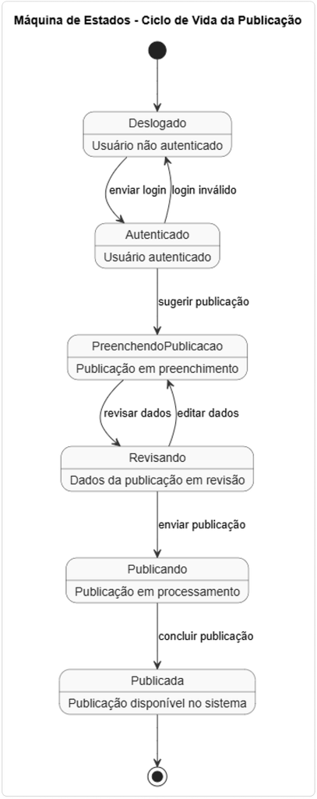

# SubEquipe_03

## Focos do Relatório:

### FOCO_01: Modelagem Estática

### Participantes no Foco_01

| Nome do Membro |
|---|
| Giovanna Felipe Guimaraes |
| Johnnatan de Salles Sanches |

### Metodologia do Foco_01

O trabalho foi desenvolvido de forma complementar entre os integrantes. Inicialmente, Johnnatan elaborou seu Diagrama de Componentes, estabelecendo uma visão mais macro do sistema. A partir dessas representações, Giovanna analisou quais aspectos poderiam ser aprofundados sem repetir o que já havia sido produzido, para elaborar um Diagrama de Componentes com maior nível de detalhamento, representando os principais componentes do frontend, serviços do backend, interfaces, dependências e bases de dados do Portal de Notícias "Burburinho".

### Modelo Estático

#### Diagrama de Componentes

<figure style="text-align: center;">

    

    <figcaption>
        

            Figura: Diagrama de Componentes do Portal de Notícias Burburinho
            (Fonte: Giovanna, 2026)
        

    </figcaption>

</figure>

#### Análise do Modelo

O Diagrama de Componentes representa a organização arquitetural do Burburinho, dividindo o sistema entre frontend, serviços de backend e bases de dados.

O `WebApp_Frontend` reúne as principais páginas da aplicação, além de componentes como `Router_Controller`, `Auth_Session`, `API_Gateway` e `Accessibility_Engine`.

O backend é dividido em três serviços principais: `Authentication_Service`, responsável pela autenticação e gerenciamento de usuários; `Content_Service`, responsável pelos conteúdos, artigos, eventos e comunidades; e `Suggestion_Service`, responsável pelo recebimento e gerenciamento das sugestões de pauta.

Também foram representadas as interfaces de comunicação e as bases `Users_DB`, `News_DB` e `Suggestions_DB`, evidenciando a separação das responsabilidades de persistência.

#### Processo de Construção

Giovanna desenvolveu o diagrama a partir da arquitetura descrita para o Burburinho e da representação elaborada anteriormente por Johnnatan. Como a representação inicial apresentava uma visão mais macro, foram detalhados os componentes internos dos principais serviços e suas relações.
Inicialmente, tentou-se utilizar o Mermaid, mas a ferramenta gerou um fluxograma genérico. Concluiu-se que ela não possuía suporte nativo para diagramas de componentes UML clássicos. Ao tentar forçar essa estrutura com o auxílio do Gemini, a ferramenta aparentemente realizava um *fallback* e renderizava blocos simples, ignorando notações essenciais, como os ícones de componente e as interfaces em “pirulito” ou soquete.

Em seguida, utilizou-se o PlantUML. As primeiras tentativas consistiram em descrever o sistema e solicitar à IA (ChatGPT) a geração do código do diagrama, mas os resultados não foram satisfatórios. Portanto, foi realizado um estudo mais aprofundado do material disponibilizado pela professora e da documentação do PlantUML sobre diagramas de componentes. A partir disso, o código do diagrama foi estruturado com o auxílio do ChatGPT gratuito, principalmente para ajustar posições que não apresentavam uma boa organização visual. Após diversas tentativas e gerações, chegou-se à versão final.

O processo e alguns dos diagramas iniciais foram documentados no Figma, tanto para registrar seu desenvolvimento quanto para apresentá-los a Johnnatan e auxiliá-lo na compreensão do raciocínio adotado: [Figma — Giovanna](https://www.figma.com/board/43vbLUUegzD0NWT89fCxS5/Giovanna?node-id=2004-278&t=iG67pfbG3gXjb8In-0).

#### Processo de Construção do diagrama inicial de Johnnatan

<figure style="text-align: center;">

    

    <figcaption>
        

            Figura: Diagrama de Componentes do Portal de Notícias Burburinho
            (Fonte: Johnnatan, 2026)
        

    </figcaption>

</figure>

O diagrama de componentes elaborado por Johnnatan apresenta uma visão macro da arquitetura do Burburinho, dividindo o sistema em dois subsistemas principais: `API Burburinho` e `Persistência`. O subsistema da API reúne quatro componentes internos — `:ServicoUsuário`, `:ServicoPublicacao`, `:ServicoCategoria` e `:ServicoA11y` — que expõem interfaces fornecidas (`IAuth`, `IPub`, `ICategoria` e `IA11y`) para comunicação externa. O componente `:ServicoPublicacao` conecta-se ao subsistema de `Persistência` por meio de uma dependência `Persistir`, que se comunica com o componente `:BancoDeDados`. A construção do diagrama foi realizada utilizando notação UML de componentes, com foco em representar as interfaces fornecidas e requeridas, bem como as relações de dependência entre os serviços da API e a camada de persistência de dados.

---

### FOCO_02: Modelagem Dinâmica

### Participantes no Foco_02

| Nome do Membro |
|---|
| Giovanna Felipe Guimaraes |
| Johnnatan de Salles Sanches |

### Metodologia do Foco_02

A modelagem dinâmica partiu de uma representação de estados previamente elaborada por Johnnatan. Durante a análise do modelo, Giovanna identificou que a estrutura dele poderia ser melhor adequada à lógica de uma máquina de estados UML.

A questão foi discutida durante a reunião do subgrupo, conforme registrado em ata. A partir dessa discussão, recomendou-se que Johnnatan também utilizasse o PlantUML para reorganizar o diagrama do Ciclo de Vida da Sugestão de Pauta, mantendo a ideia central da representação original.

### Modelo Dinâmico

#### Giovanna - Ciclo de Vida da Sugestão de Pauta

<figure style="text-align: center;">

    

    <figcaption>
        

            Figura: Máquina de Estados - Ciclo de Vida da Sugestão de Pauta
            (Fonte: Giovanna, 2026)
        

    </figcaption>

</figure>

#### Análise do Modelo - Giovanna

A máquina de estados representa o ciclo de vida de uma sugestão de pauta no Burburinho.

O fluxo começa em `Rascunho`, quando o usuário inicia e preenche a sugestão. Após o envio, a sugestão passa para `Enviada` e posteriormente para `EmAnalise`.

O estado `EmAnalise` possui estados internos relacionados à validação e aos possíveis ajustes. Caso sejam necessários ajustes, a sugestão pode retornar para validação após o reenvio.

Após a análise, existem dois caminhos: `Aprovada` ou `Rejeitada`. Uma sugestão aprovada segue para `EmProducao` e posteriormente para `Publicada`. Uma sugestão rejeitada encerra o fluxo.

#### Johnnatan - Ciclo de Vida da Publicação

<figure style="text-align: center;">

    

    <figcaption>
        

            Figura: Máquina de Estados - Ciclo de Vida da Publicação
            (Fonte: Johnnatan, 2026)
        

    </figcaption>

</figure>

#### Análise do Modelo - Johnnatan

A máquina de estados elaborada por Johnnatan representa o ciclo de vida de uma publicação no Burburinho, desde o acesso do usuário até a disponibilização do conteúdo no sistema.

O fluxo inicia no estado `Deslogado`, onde o usuário ainda não está autenticado. Ao enviar o login, caso as credenciais sejam válidas, o sistema transita para o estado `Autenticado`; caso contrário, permanece em `Deslogado` (transição de login inválido).

Após a autenticação, o usuário pode sugerir uma publicação, levando o sistema ao estado `PreenchendoPublicacao`, onde a publicação está em preenchimento. Em seguida, o fluxo segue para `Revisando`, no qual os dados da publicação são revisados. Neste estado, é possível editar os dados, retornando ao preenchimento, ou confirmar a revisão.

Ao enviar a publicação, o sistema transita para o estado `Publicando`, onde a publicação está em processamento. Por fim, ao concluir o processamento, a publicação alcança o estado final `Publicada`, ficando disponível no sistema.

---

### FOCO_03: IA Generativa

Entrega Mínima: pontos de vista de cada membro da equipe sobre as lições aprendidas e uso da IA Generativa.

### Participantes no Foco_03

| Nome do Membro | Lições Aprendidas | Uso da IA Generativa (SENSO CRÍTICO) |
|---|---|---|
| Giovanna Felipe Guimaraes | Durante a elaboração dos diagramas UML, foi possível aprofundar a compreensão sobre a importância de utilizar corretamente as notações e estruturas próprias de cada modelo. A experiência mostrou que não basta representar visualmente os elementos do sistema, sendo necessário compreender o significado e a relação entre eles para que o diagrama realmente represente o comportamento ou a estrutura pretendida. A comparação entre diferentes ferramentas e abordagens também contribuiu para perceber as limitações de determinadas soluções e a importância de estudar a documentação e os materiais da disciplina antes de definir a representação final. Além disso, o próprio processo de diagramar possibilitou identificar dúvidas, decisões de modelagem e diferentes formas de representar o sistema que poderiam gerar discussões relevantes para serem levadas ao grupo geral, contribuindo não apenas para a construção dos artefatos, mas também para o compartilhamento e aprofundamento do conhecimento durante as discussões. | A IA generativa foi utilizada principalmente como ferramenta de apoio durante a construção dos diagramas, especialmente na geração e adaptação de códigos PlantUML e na exploração de possibilidades de representação. Inicialmente, algumas sugestões geradas não apresentavam uma organização visual ou uma estrutura adequada à notação UML esperada. Isso mostrou que a geração automática do código não garante que o resultado esteja conceitualmente correto. Por esse motivo, foi necessário consultar os materiais disponibilizados na disciplina e a documentação do PlantUML, além de analisar criticamente cada resultado gerado. A IA foi mais útil para auxiliar nos ajustes do código e na experimentação de diferentes organizações dos elementos, enquanto as decisões sobre a estrutura e a adequação dos diagramas foram realizadas a partir do conhecimento adquirido e da análise das referências utilizadas. Dessa forma, a experiência reforçou a percepção de que a IA pode acelerar o desenvolvimento dos artefatos, mas não substitui a compreensão da notação nem a validação humana dos resultados. |
| Johnnatan de Salles Sanches | A elaboração dos diagramas de componentes e de estados permitiu consolidar o entendimento sobre como representar a arquitetura e o comportamento dinâmico de um sistema utilizando notação UML. O processo de construção evidenciou a importância de definir claramente as interfaces entre os componentes e os estados possíveis de uma entidade, bem como as transições que governam seu ciclo de vida. A construção do Diagrama de Componentes exigiu a compreensão das diferenças entre interfaces fornecidas e requeridas, além da relação de dependência entre subsistemas. Já a Máquina de Estados demandou atenção especial à definição precisa dos estados, das condições de guarda e das transições, garantindo que o fluxo representasse fielmente o ciclo de vida de uma publicação no sistema. A comparação entre as abordagens adotadas pelos integrantes do subgrupo contribuiu para identificar diferentes níveis de abstração e complementar as representações produzidas, reforçando a importância do trabalho colaborativo no refinamento dos artefatos. | A IA generativa foi utilizada como ferramenta de apoio na geração inicial dos códigos dos diagramas e na exploração de alternativas de representação. No Diagrama de Componentes, a IA auxiliou na estruturação inicial dos subsistemas e componentes internos, porém foi necessário revisar e ajustar manualmente as interfaces fornecidas e requeridas, bem como a relação de dependência entre o serviço de publicação e o banco de dados. Na Máquina de Estados, a IA contribuiu com a definição inicial dos estados e transições, mas foram identificados problemas como transições redundantes e ausência de auto-transições relevantes, exigindo correções manuais. De modo geral, percebeu-se que a IA tende a gerar representações genéricas que não consideram as particularidades do domínio modelado. A experiência reforçou que a IA pode agilizar etapas iniciais do processo de modelagem, mas exige validação crítica por parte do autor — funcionando melhor como ponto de partida para iteração do que como solução pronta. |

---
## Versionamentos

| Nome do Membro | Contribuição | Data |
|---|---|---|
| Giovanna Felipe Guimaraes | Acrescenta metodologias, artefatos individuais, lições aprendidas e ponto de vista sobre IA Generativa | 17/09/2026 |
| Johnnatan de Salles Sanches | Acrescenta artefatos individuais, lições aprendidas e ponto de vista sobre IA Generativa | 17/09/2026 |

OBS: TODOS DEVEM PARTICIPAR, MOSTRANDO SEUS PONTOS DE VISTA E COMO COLABORARAM NA ENTREGA.

---
# Observações:

O trabalho buscou complementar as modelagens desenvolvidas pelos dois integrantes presentes, considerando que um dos alunos do grupo trancou a disciplina. As atividades foram desenvolvidas utilizando diferentes níveis de abstração para representar aspectos estruturais e dinâmicos do Portal de Notícias "Burburinho".

As decisões de modelagem foram discutidas entre os integrantes durante o desenvolvimento e, quando necessário, ajustadas a partir das discussões realizadas na reunião do subgrupo.
---
# Referências

UNIVERSIDADE DE BRASÍLIA. Faculdade de Ciências e Tecnologias em Engenharia. 
**FCTE_ARQ-DSW: Disciplina de Arquitetura & Desenho de Software**. 
Brasília, DF, 2026. Disponível em: 
<https://sites.google.com/view/unb-fcte-arqdsw>. Acesso em: 15 set. 2026.

PLANTUML. **Component Diagram**. [S. l.], [s. d.]. Disponível em: 
<https://plantuml.com/component-diagram>. Acesso em: 15 set. 2026.

UML-DIAGRAMS.ORG. **UML State Machine Diagrams: Overview of Graphical Notation**. 
[S. l.], [s. d.]. Disponível em: 
<https://www.uml-diagrams.org/state-machine-diagrams.html>. Acesso em: 15 set. 2026.