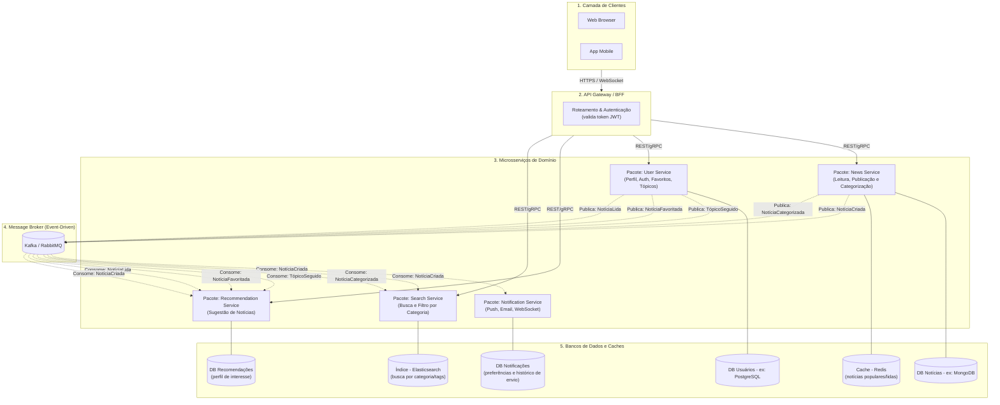

# Arquitetura de Microsserviços - Plataforma de Notícias



Código em mermaid:

```bloco_em_mermaid
flowchart TD
    %% Camada de Apresentação
    subgraph Clients ["1. Camada de Clientes"]
        Web[Web Browser]
        App[App Mobile]
    end

    %% Porta de Entrada
    subgraph Gateway ["2. API Gateway / BFF"]
        Router["Roteamento & Autenticação<br>(valida token JWT)"]
    end

    %% Domínios de Negócio (Microsserviços)
    subgraph Services ["3. Microsserviços de Domínio"]
        News["Pacote: News Service<br>(Leitura, Publicação e Categorização)"]
        User["Pacote: User Service<br>(Perfil, Auth, Favoritos, Tópicos)"]
        Notif["Pacote: Notification Service<br>(Push, Email, WebSocket)"]
        Reco["Pacote: Recommendation Service<br>(Sugestão de Notícias)"]
        Search["Pacote: Search Service<br>(Busca e Filtro por Categoria)"]
    end

    %% Infraestrutura de Eventos
    subgraph EventBus ["4. Message Broker (Event-Driven)"]
        Kafka[("Kafka / RabbitMQ")]
    end

    %% Bancos de Dados e Caches
    subgraph Databases ["5. Bancos de Dados e Caches"]
        DB_News[("DB Notícias - ex: MongoDB")]
        DB_User[("DB Usuários - ex: PostgreSQL")]
        DB_Notif[("DB Notificações<br>(preferências e histórico de envio)")]
        DB_Reco[("DB Recomendações<br>(perfil de interesse)")]
        Cache[("Cache - Redis<br>(notícias populares/lidas)")]
        Index[("Índice - Elasticsearch<br>(busca por categoria/tags)")]
    end

    %% Relacionamentos e Fluxos
    Clients -->|HTTPS / WebSocket| Gateway
    Gateway -->|REST/gRPC| News
    Gateway -->|REST/gRPC| User
    Gateway -->|REST/gRPC| Reco
    Gateway -->|REST/gRPC| Search

    News --- DB_News
    News --- Cache
    User --- DB_User
    Notif --- DB_Notif
    Reco --- DB_Reco
    Search --- Index

    %% Fluxo de Eventos - Publicação
    News -.->|Publica: NotíciaCriada| Kafka
    News -.->|Publica: NotíciaCategorizada| Kafka
    User -.->|Publica: TópicoSeguido| Kafka
    User -.->|Publica: NotíciaFavoritada| Kafka
    User -.->|Publica: NotíciaLida| Kafka

    %% Fluxo de Eventos - Consumo
    Kafka -.->|Consome: NotíciaCriada| Notif
    Kafka -.->|Consome: NotíciaCriada| Search
    Kafka -.->|Consome: NotíciaCategorizada| Search
    Kafka -.->|Consome: TópicoSeguido| Reco
    Kafka -.->|Consome: NotíciaFavoritada| Reco
    Kafka -.->|Consome: NotíciaLida| Reco
    Kafka -.->|Consome: NotíciaCriada| Reco
```
