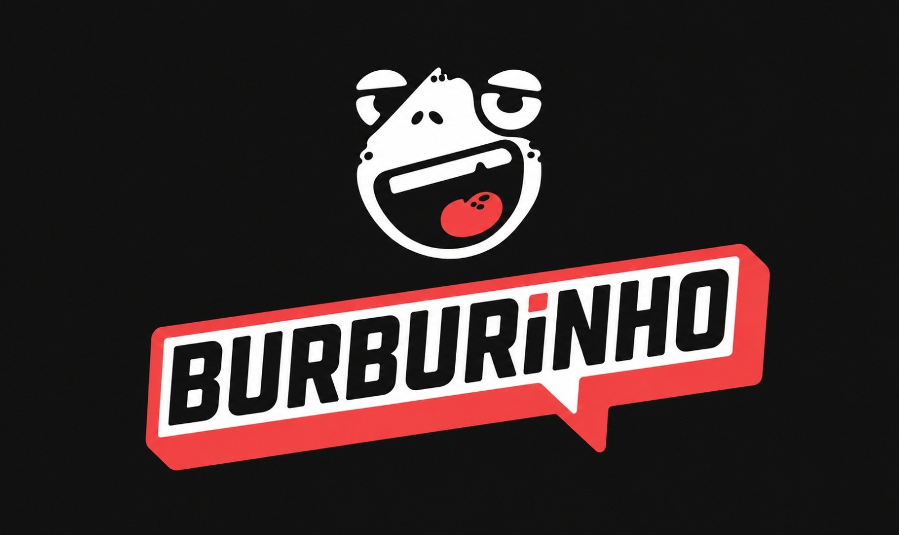

# Portal de Noticias Burburinho

<figure style="text-align: center;">
    
    <figcaption>
        <p style="text-align: center; font-size: 10pt;">
            Figura: Logo Burburinho (Fonte: Equipe, 2026)
        </p>
    </figcaption>
</figure>

## Introdução

O **Burburinho** é um portal de noticias desenvolvido para reunir informações sobre atualidades e assuntos de interesse geral em um único espaco. A proposta oferece uma experiência simples para que os usuários acompanhem noticias e também participem da produção de conteúdo, sugerindo e compartilhando publicações com a comunidade.

Este projeto foi desenvolvido para a disciplina **Arquitetura e Desenho de Software**, com foco em conteudo jornalístico e contribuições dos usuários (UGC, ou *User-Generated Content*).

**Código da Disciplina**: FGA0208  
**Número do Grupo**: 03  
**Entrega**: 02

## Membros do grupo

| Aluno | GitHub |
| -- | -- |
| Andre Henrique de Souza Belarmino | [andrehsb](https://github.com/andrehsb) |
| Giovanna Aguiar de Brito | [giovannabrito19](https://github.com/giovannabrito19) |
| Giovanna Felipe Guimaraes | [giovannafg](https://github.com/giovannafg) |
| Joao Pedro Lopes da Cruz | [ojplc](https://github.com/ojplc) |
| Johnnatan de Salles Sanches | [jsalless](https://github.com/jsalless) |
| Julia Gabriella Ferreira Siqueira | [juliagabriellafs](https://github.com/juliagabriellafs) |
| Luis Felipe Parreira Cunha | [cunha-luiss](https://github.com/cunha-luiss) |
| Matheus Eiki Kimura | [mateiki](https://github.com/mateiki) |
| Pedro Henrique Ferreira Xavier | [PedroGTG](https://github.com/PedroGTG) |

## Tecnologia

A documentacao é publicada com [MkDocs](https://www.mkdocs.org/) e o tema [Material](https://squidfunk.github.io/mkdocs-material/).

### Execução local

```shell
python -m venv venv
source venv/bin/activate
pip install -r requirements.txt
mkdocs serve
```

## Screenshots da Primeira Entrega

## Há algo a ser executado?

( ) SIM

(x) NÃO


## Informações Complementares

Quaisquer outras informações adicionais podem ser descritas nessa seção.

## Histórico de versoes

| Versão | Descrição | Autor | Data | Revisor |
|:-:|:-:|:-:|:-:|:-:|
| 0.1 | Migracao da documentação para MkDocs Material e atualização da identidade visual do Burburinho | Luís Felipe | 14/09 |